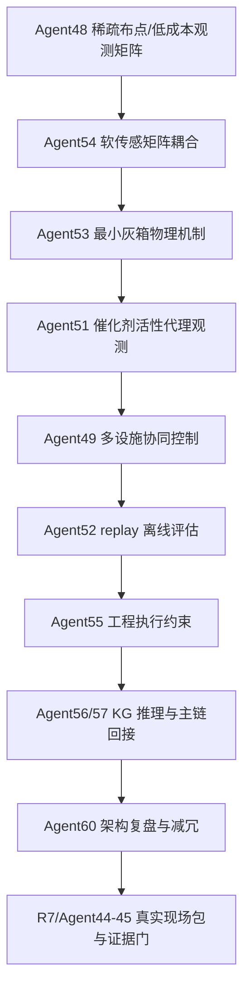

# CODEGRAPH

这是本项目的结构化入口。后续进入项目时，先读这里，再按任务跳转；不要先全仓扫描。

## 当前图谱状态

- 文件数：`409`
- 节点数：`5481`
- 边数：`8636`
- Agent workflow 数：`58`
- 说明：已安装 GitHub `lzehrung/codegraph` skill；本机缺少 Node.js 24.10+ / `codegraph` CLI，所以本图谱由 `tools/build_project_codegraph.py` 生成。

## 最短阅读路径

1. `notes/current_status.md`：看当前模型状态和最近迭代边界。
2. `deliverables/manifest.json`：看核心产物、指标和输出目录索引。
3. `deliverables/model_core_optimization/model_core_goal.md`：看第一性原理和七层骨架。
4. `deliverables/codegraph/codegraph_summary.md`：看完整 agent/file/edge 索引。
5. `deliverables/codegraph/scan_shortcuts.md`：按当前任务选择最短后续文件。

## 当前核心模型链路

## 核心 Agent 快捷入口

| Agent | 作用 | runner | source | test |
| ---: | --- | --- | --- | --- |
| 48 | `sensor_network_sparse_placement` | `experiments/run_agent48_sensor_network_sparse_placement.py` | `src/water_ai/agents/sensor_network_sparse_placement_agent.py` | `tests/test_sensor_network_sparse_placement_agent.py` |
| 51 | `catalyst_activity_proxy` | `experiments/run_agent51_catalyst_activity_proxy.py` | `src/water_ai/agents/catalyst_activity_proxy_agent.py` | `tests/test_catalyst_activity_proxy_agent.py` |
| 49 | `multi_facility_collaborative_control` | `experiments/run_agent49_multi_facility_collaborative_control.py` | `src/water_ai/agents/multi_facility_collaborative_control_agent.py` | `tests/test_multi_facility_collaborative_control_agent.py` |
| 52 | `multi_facility_replay_evaluation` | `experiments/run_agent52_multi_facility_replay_evaluation.py` | `src/water_ai/agents/multi_facility_replay_evaluation_agent.py` | `tests/test_multi_facility_replay_evaluation_agent.py` |
| 53 | `minimal_grey_box_physics` | `experiments/run_agent53_minimal_grey_box_physics.py` | `src/water_ai/agents/minimal_grey_box_physics_agent.py` | `tests/test_minimal_grey_box_physics_agent.py` |
| 54 | `soft_sensor_matrix_coupling` | `experiments/run_agent54_soft_sensor_matrix_coupling.py` | `src/water_ai/agents/soft_sensor_matrix_coupling_agent.py` | `tests/test_soft_sensor_matrix_coupling_agent.py` |
| 56 | `knowledge_graph_reasoning` | `experiments/run_agent56_knowledge_graph_reasoning.py` | `src/water_ai/agents/knowledge_graph_reasoning_agent.py` | `tests/test_knowledge_graph_reasoning_agent.py` |
| 57 | `main_chain_reconnection` | `experiments/run_agent57_main_chain_reconnection.py` | `src/water_ai/agents/main_chain_reconnection_agent.py` | `tests/test_main_chain_reconnection_agent.py` |
| 60 | `agent_architecture_consolidation` | `experiments/run_agent60_agent_architecture_consolidation.py` | `src/water_ai/agents/agent_architecture_consolidation_agent.py` | `tests/test_agent_architecture_consolidation_agent.py` |
| 61 | `pressure_resolution_replay_scenario_pack` | `experiments/run_agent61_pressure_resolution_replay_scenario_pack.py` | `src/water_ai/agents/pressure_resolution_replay_scenario_pack_agent.py` | `tests/test_pressure_resolution_replay_scenario_pack_agent.py` |

## 图谱产物

- `deliverables/codegraph/project_codegraph.json`：完整机器可读图谱。
- `deliverables/codegraph/project_codegraph_nodes.csv`：节点表。
- `deliverables/codegraph/project_codegraph_edges.csv`：边表。
- `deliverables/codegraph/codegraph_summary.md`：人读摘要。
- `deliverables/codegraph/scan_shortcuts.md`：后续工作最短路径。
- `deliverables/codegraph/task_routes.json`：按任务主题分组的跳转索引。
- `deliverables/codegraph/packets/`：核心 agent 的 packet 式上下文包。
- `deliverables/codegraph/native_vs_fallback_evaluation.md`：原生工具与本地 fallback 的效果比较。

## 使用规则

- 结构问题先看图谱，行为问题仍要跑测试或实验脚本。
- 图谱里的引用关系是定位线索，不是运行时事实证明。
- `synthetic/sample/template` 产物只能作为接口验证或仿真基线，不能当现场实证结论。
- 若未来安装 Node.js 24.10+ 和 `@lzehrung/codegraph` CLI，可按 `codegraph.config.json` 重新生成原生 CodeGraph artifact。
