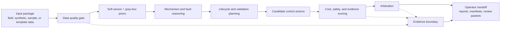
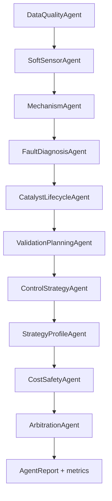
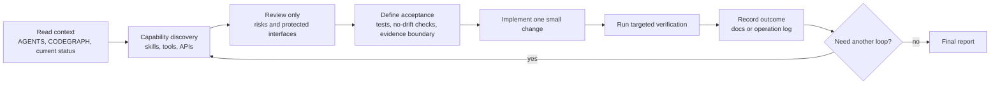

# Low-Cost Sensor Water Loop AI

低成本传感循环式水处理智能闭环研究原型。

This repository contains a reproducible Python research workspace for exploring how low-cost sensing, grey-box soft sensing, evidence gates, and multi-agent decision logic can support circular water-treatment control.

The project is intentionally conservative: it can simulate, replay, validate interfaces, rank protective actions, and prepare operator handoffs, but it does not claim field performance until real field packages pass the required evidence gates.

## What This Is

- A research prototype for circular water-treatment control under sparse and low-cost sensing.
- A structured multi-agent workflow for data quality, soft sensing, mechanism reasoning, fault diagnosis, validation planning, control strategy, safety/cost scoring, and arbitration.
- A set of experiment runners, templates, manifests, and review artifacts that make each claim traceable.
- A field-data onboarding scaffold: real sensor/lab/operation/replay packages can be checked before they influence any downstream decision.

## What This Is Not

- Not a production control system.
- Not an actuator-writing or release-gate-writing system.
- Not a field-validated model by default.
- Not a legal, patentability, or regulatory opinion engine.

## System Workflow



## Why Each Step Exists

| Step | Purpose | Why it matters |
| --- | --- | --- |
| Input package | Accept field packages, synthetic fixtures, templates, or literature-derived scaffolds. | Keeps the project useful before field data arrives while preserving the difference between test data and real evidence. |
| Data quality gate | Check missing values, out-of-range values, stale signals, provenance, template markers, and package shape. | Low-cost sensors are noisy; bad input must be blocked before it becomes a model claim. |
| Soft sensor + grey-box priors | Estimate hidden process states such as catalyst activity, hydraulic confidence, matrix interference, and byproduct risk. | The system often cannot measure the important state directly, so it needs auditable estimates with uncertainty and physics constraints. |
| Mechanism and fault reasoning | Connect state estimates to likely mechanisms, faults, and knowledge-graph evidence. | Operators need an explanation, not only a score. This layer makes action recommendations inspectable. |
| Lifecycle and validation planning | Decide whether more hold time, lab validation, catalyst regeneration, replacement, or replay evidence is needed. | Circular operation is valuable because it can buy time for slower evidence instead of forcing premature release. |
| Candidate control actions | Generate conservative options such as hold, recycle, dose adjustment, unit switch, manual review, regeneration, or replacement. | Separates action generation from final approval so safety gates can reject risky choices later. |
| Cost, safety, and evidence scoring | Score actions against risk, energy, reagent use, time, evidence strength, and no-write boundaries. | Prevents optimization from drifting into cheap-but-unsafe or unsupported recommendations. |
| Arbitration | Apply hard gates and produce a final ranked action set. | Centralizes the final decision contract and keeps protected keys stable for tests and downstream manifests. |
| Operator handoff | Write JSON, Markdown, CSV, and manifest outputs for humans or later agents to review. | The current mature output is a reviewable handoff, not autonomous plant control. |

## Protected Boundaries

These boundaries are part of the research contract and should not be weakened in refactors:

- `synthetic`, `sample`, `template`, and `literature` artifacts are not field evidence.
- Real field claims require accepted field packages, replay or holdout checks, and human/operator review where required.
- `can_write_to_actuator=False` and `can_write_to_release_gate=False` semantics must remain intact unless a future documented safety case changes the project scope.
- Core report structures such as `AgentReport`, `SensorReading`, and `QualityIssue` are treated as public internal contracts.
- Main-chain ordering is protected: data quality -> soft sensor -> mechanism -> fault diagnosis -> lifecycle -> validation planning -> control strategy -> strategy profile -> cost/safety -> arbitration.
- Stable metric keys such as `state_estimate`, `ranked_actions`, `evaluated_actions`, `final_plan`, `blocked_actions`, and `selected_profile` should not be renamed casually.

## Quick Start

Use Python 3.12.

```bash
python3.12 -m venv .venv
.venv/bin/python -m pip install -U pip
.venv/bin/python -m pip install -r requirements.txt
.venv/bin/python -m pip install -e .
.venv/bin/python -m pytest -q
```

If editable install is not available, run experiment scripts with `PYTHONPATH=src`.

## Common Commands

```bash
.venv/bin/python -m pytest -q
.venv/bin/python experiments/run_closed_loop_episode.py
.venv/bin/python experiments/run_scenario_sweep.py
.venv/bin/python experiments/run_agent44_field_replay_import.py
.venv/bin/python experiments/run_agent50_model_core_governance.py
.venv/bin/python experiments/run_formal_search_nonlegal_review_operator_packet.py
```

Use targeted tests for focused changes:

```bash
PYTHONDONTWRITEBYTECODE=1 .venv/bin/python -m pytest -q -p no:cacheprovider tests/test_project_independence.py
PYTHONDONTWRITEBYTECODE=1 .venv/bin/python -m pytest -q -p no:cacheprovider tests/test_formal_search_nonlegal_review_operator_packet.py
```

## Repository Map

| Path | Role |
| --- | --- |
| `src/water_ai/` | Runtime package: domain objects, pipeline logic, agents, gates, and helper modules. |
| `experiments/` | Runnable scripts that generate reports, metrics, manifests, and handoff artifacts. |
| `tests/` | Regression tests for protected behavior, evidence boundaries, runner contracts, and manifests. |
| `docs/` | Specifications, review notes, field interface docs, and research documents. |
| `notes/current_status.md` | Detailed internal status log and latest iteration boundaries. |
| `CODEGRAPH.md` | Short navigation entry for repo structure, core agent routes, and graph artifacts. |
| `deliverables/` | Publishable or review-facing artifacts, manifests, summaries, and codegraph exports. |
| `outputs/` | Generated experiment outputs, templates, metrics, and replay packages. |
| `models/` | Local model artifacts. Large generated binaries are ignored unless explicitly curated. |

## Main Runtime Chain



Additional agents extend the core chain for sensitivity analysis, campaign planning, sparse sensor placement, catalyst proxy evidence, field replay import, evidence gates, architecture consolidation, and operator handoff preparation. See `CODEGRAPH.md` for the shortest route into those modules.

## Current Maturity

The framework is mature enough for structured review and targeted refactoring:

- Core chain contracts are covered by tests.
- Field package schemas and templates exist.
- Evidence gates distinguish synthetic/template/sample data from field evidence.
- Governance and manifest outputs expose the current blockers.
- The main bottleneck is real field package availability, not adding more agents.

The recommended next technical work is behavior-preserving cleanup: runner IO helpers, manifest path handling, generated artifact writers, and review-loop guided refactors.

## Review Loop For Contributors

Use this loop for any non-trivial change:



Each recommendation should name:

- the risk it reduces,
- the interface it must not change,
- the test command that proves it,
- the reason it is more valuable than nearby alternatives.

## Open-Source Hygiene

- Keep local absolute paths, personal workspace names, virtual environments, caches, and generated bytecode out of committed docs and code.
- Keep generated artifacts traceable through manifests, but avoid committing heavy local-only binaries.
- Do not publish private field data, credentials, operator notes, or unreleased partner material.
- The repository is MIT licensed; third-party dependencies and any externally supplied datasets remain under their own terms.

## License

MIT License. See `LICENSE`.
