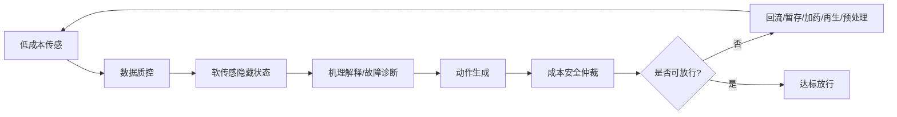
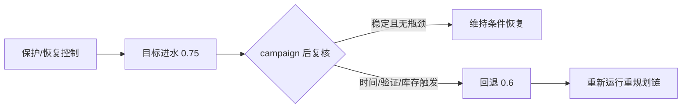
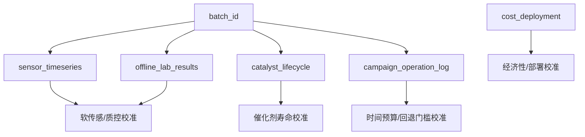

# 图表素材规格

## grey_box_loop 黑箱到灰箱逻辑图

- 类型：`mermaid`


## control_loop 循环式闭环控制图

- 类型：`mermaid`



## agent_layer_map Agent 分层图

- 类型：`mermaid`

```mermaid
flowchart TB
    G1["1-2 感知与软传感"] --> G2["3-4 机理诊断"]
    G2 --> G3["5-10 控制与仲裁"]
    G3 --> G4["11-13 传感配置与批次调度"]
    G4 --> G5["14-18 资源/经济/实施"]
    G5 --> G6["19-23 在线重规划"]
    G6 --> G7["24-28 恢复控制"]
    G7 --> G8["29-30 项目总览与真实数据接口"]
    G8 --> G9[31-33 整理/汇报/正式 deck"]
```

## evidence_waterfall 瓶颈到重规划证据链

- 类型：`mermaid`


## recovery_boundary 恢复进水边界图

- 类型：`mermaid`



## field_data_schema 真实数据接口图

- 类型：`mermaid`



## validation_boundary 边界说明卡片

- 类型：`callout`
- 当前可用于项目书、原型展示和实证前仿真基线。
- 当前 synthetic/sample 数据只能验证接口，不等于现场实证。
- 必须继续校准真实传感漂移、催化剂寿命、副产物风险和部署接口。

## calibration_roadmap P1-P6 实证校准路线

- 类型：`timeline`
- P1 传感器噪声与漂移
- P2 软传感器真实标签重训
- P3 催化剂寿命与副产物风险
- P4 时间预算与回退门槛
- P5 经济性与部署接口
- P6 时间戳回放与快代理校准
