# 专业技术导图：低成本传感循环式水处理智能灰箱闭环系统

生成时间：2026-06-04  
定位：面向专业人士的系统技术路线导图。它展示的是模型核心骨架、工程实现路径、创新点、证据边界和当前成熟度，不是展示材料美化稿。

## 读图摘要

本项目的核心不是“用 AI 做水处理”这个泛泛命题，而是一个受限观测条件下的工程闭环系统：

> 低成本传感导致水处理过程不可完全观测；循环/暂存结构为低频检测和软传感估计争取时间；稀疏布点与软传感把黑箱变成灰箱；知识图谱、灰箱机理和多智能体系统给出诊断与控制候选；field replay、holdout、operator review 和 release gate 决定哪些候选能被升级，哪些必须停留在 synthetic/literature/template 阶段。

当前状态是：架构合同、观测合同、source_basis、synthetic replay 和治理终止条件已经形成；真实现场数据包、field holdout、operator review、actuator feedback 和 release validation 仍未完成。

## 图 1：系统总技术路线

```mermaid
flowchart LR
    P0["真实污染场景<br/>污染物/废水基质/处理单元/管网拓扑/循环结构"] --> C0["核心工程矛盾<br/>低成本传感 + 低频采样 + 中间黑箱"]
    C0 --> T0["循环式结构争取时间<br/>回流/暂存/延长停留/分段验证"]
    T0 --> O0["稀疏观测层<br/>node-modality 矩阵<br/>pH/ORP/EC/UV254/浊度/流量/温度"]
    O0 --> S0["状态估计层<br/>软传感 + 灰箱先验<br/>隐藏状态 ledger"]
    S0 --> K0["机理证据层<br/>KG/source_basis/参数边界/失败边界"]
    K0 --> D0["诊断决策层<br/>多智能体解释/故障诊断/控制候选/策略蒸馏"]
    D0 --> A0["闭环执行候选<br/>回流/暂存/加药/切换单元/再生/阻断/放行候选"]
    A0 --> T0
    A0 --> V0["验证治理层<br/>synthetic replay/field package/holdout/operator review/release gate"]
    V0 -->|通过 field gate| F0["field-supported candidate<br/>可进入人工复核后的工程试验"]
    V0 -->|未通过| W0["等待态/外部阻断<br/>不写 actuator<br/>不写 release gate<br/>不升级 field claim"]

    classDef problem fill:#fff1f2,stroke:#be123c,color:#111827;
    classDef core fill:#ecfeff,stroke:#0891b2,color:#111827;
    classDef evidence fill:#fefce8,stroke:#ca8a04,color:#111827;
    classDef action fill:#ecfdf5,stroke:#059669,color:#111827;
    classDef gate fill:#f5f3ff,stroke:#7c3aed,color:#111827;
    class C0 problem;
    class T0,O0,S0 core;
    class K0 evidence;
    class D0,A0 action;
    class V0,F0,W0 gate;
```

## 图 2：七层系统骨架与当前产物

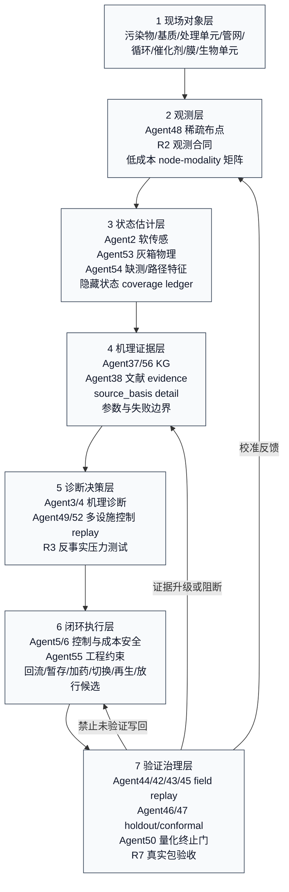

## 图 3：核心工程实现路径

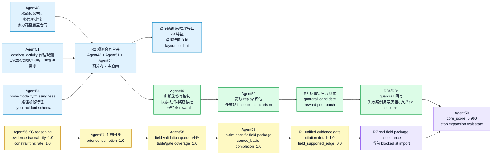

## 图 4：观测层技术路径

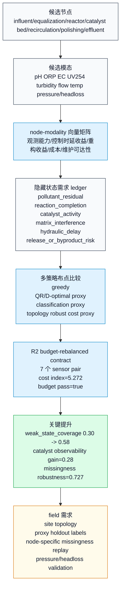

## 图 5：状态估计与灰箱化路径

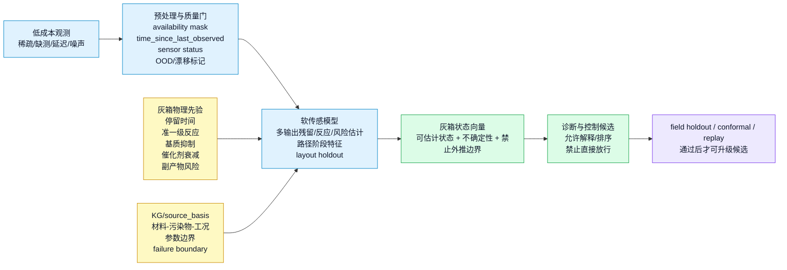

## 图 6：闭环控制与 replay 验证路径

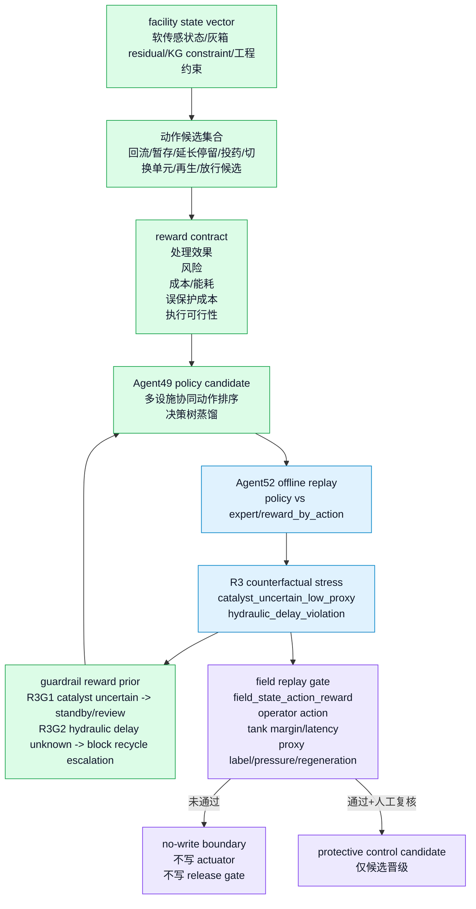

## 图 7：证据分层与终止条件

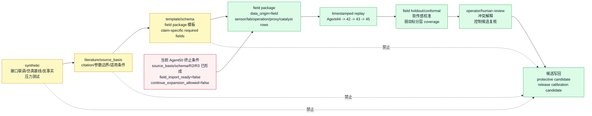

## 图 8：创新点与工程技术效果映射

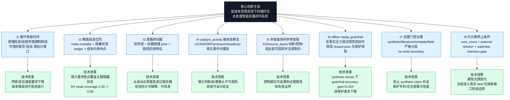

## 图 9：工程借鉴路径与本项目映射

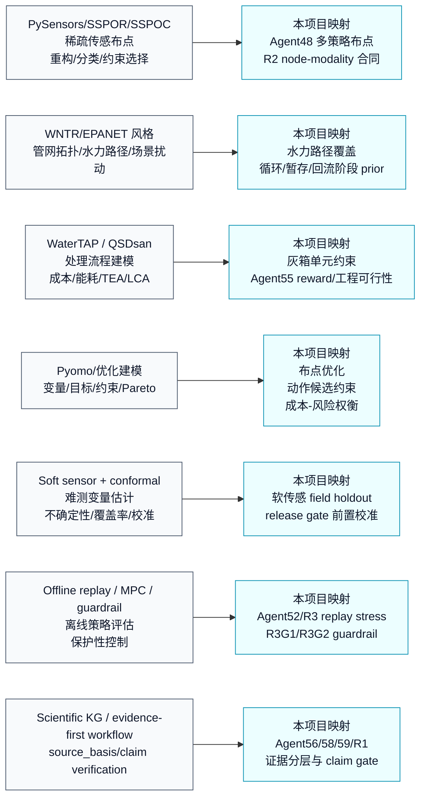

## 当前关键指标快照

| 维度 | 当前值 | 含义 | 边界 |
|---|---:|---|---|
| Agent50 core_score | 0.960 | 架构/接口/证据治理成熟度高 | 不是 field validation 分数 |
| hidden state contract coverage | 1.000 | 6 个关键隐藏状态均进入可追踪合同 | field_validated_state_coverage 仍为 0 |
| sparse_estimation_ready_coverage | 0.667 | 4/6 状态具备 sparse estimation ready | catalyst/matrix 仍需 field label 或补丁验证 |
| R2 proxy_enhanced_weak_state_coverage | 0.580 | catalyst_activity 设计覆盖从 0.30 提升到 0.58 | 仍需 proxy holdout labels |
| R2 recommended sensor count | 7 | 预算内观测合同 | 不是最终现场布点 |
| R2 cost index | 5.272 | budget pass=true | 仍需 installability/topology 校验 |
| R3 guardrail accuracy gain | 0.333 | synthetic counterfactual stress 下 guardrail 提升 | 不代表现场控制有效 |
| source_basis completion | 1.000 | 文献依据、参数边界、failure boundary 已闭合 | field_supported_edge_ratio=0 |
| field_import_ready | false | 真实包未导入 | 当前进入等待态 |
| continue_expansion_allowed | false | 内部继续堆 P1-P11 低边际 | 下一步需真实 field 包或新核心接口 |

## 专利/论文层面的创新表达骨架

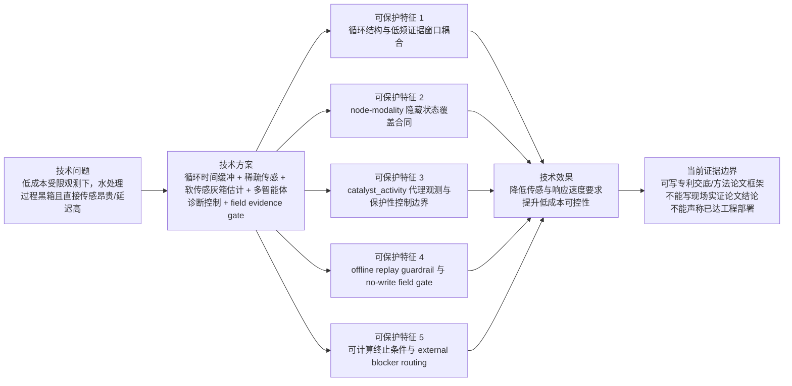

## 下一步专业路线判断

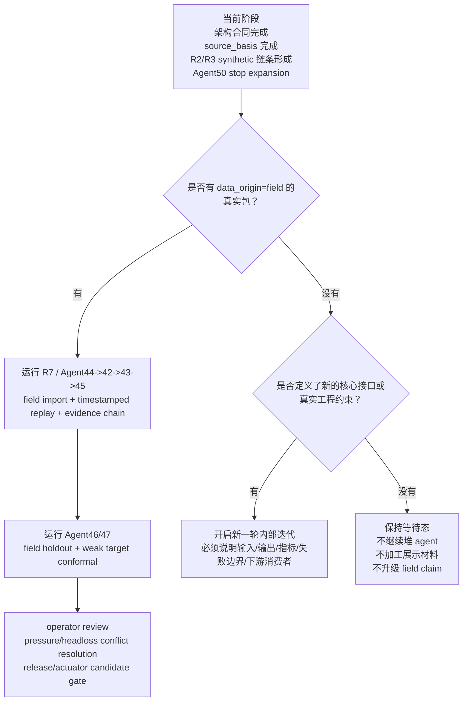

## 方法来源与借鉴说明

本导图中的外部工程路径只作为方法启发和接口设计依据，不等同于本项目已经安装或完整复现这些框架。

- PySensors：借鉴 sparse sensor placement、重构/分类任务、约束传感选择思想，用于 Agent48/R2 的 node-modality 布点合同。项目源：[dynamicslab/pysensors](https://github.com/dynamicslab/pysensors)。
- WNTR/EPANET 风格：借鉴管网拓扑、水力路径和事件扰动模拟思想，用于循环/回流/暂存路径覆盖合同。项目源：[USEPA/WNTR](https://github.com/USEPA/WNTR)。
- WaterTAP：借鉴水处理 flowsheet、单元模型、约束与成本建模组织方式，用于灰箱过程和工程约束设计。项目源：[watertap-org/watertap](https://github.com/watertap-org/watertap)。
- QSDsan：借鉴系统模拟、技术经济和可持续性评价组织方式，用于 reward/cost/sustainability 字段设计。项目源：[QSD-Group/QSDsan](https://github.com/QSD-Group/QSDsan)。
- Pyomo：借鉴结构化优化建模，把布点、动作选择、成本、风险和约束转成可求解接口。项目源：[Pyomo/pyomo](https://github.com/Pyomo/pyomo)。

## 一句话专业结论

本项目当前最强的技术主张是：把低成本传感、循环式水处理、软传感灰箱估计、知识证据、多智能体诊断控制和 field replay gate 组织成一个可验证、可终止、可逐步工程化的复杂系统，而不是单独宣称某个 AI 模型能够直接解决水处理问题。
