# 低成本传感循环式水处理多智能体系统规格

更新时间：2026-06-01

## 研究目标

在低成本传感条件下，通过循环式水处理结构为软传感器和多智能体诊断争取时间，利用软传感器估计不可直接观测的过程状态，再由多智能体系统完成机理解释、故障诊断与闭环控制，动态决定是否回流、延长停留时间、调整药剂投加、预处理/切换单元或进入放行。

## 当前系统链条

```mermaid
flowchart LR
    A["低成本传感流<br/>pH/ORP/EC/浊度/温度/流量/UV254"] --> B["Agent 1<br/>数据质控"]
    B --> C["Agent 2<br/>软传感灰箱估计"]
    K["结构化知识库<br/>污染物-材料-机制"] --> D["Agent 3<br/>机理解释"]
    C --> D
    D --> E["Agent 4<br/>故障诊断"]
    E --> L["Agent 5<br/>催化剂生命周期"]
    E --> V["Agent 6<br/>旁路验证规划"]
    L --> F["Agent 7<br/>控制策略"]
    V --> F
    F --> P["Agent 8<br/>策略目标选择"]
    P --> G["Agent 9<br/>成本安全评价"]
    G --> H["Agent 10<br/>最终仲裁"]
    H --> I["过程动力学反馈<br/>回流/加药/暂存/预处理/再生/更换/放行"]
    I --> A
    H --> J["Agent 11<br/>传感-循环窗口敏感性分析"]
    H --> O["Agent 12<br/>多批次运行调度"]
    O --> Q["Agent 13<br/>批次队列规划"]
    Q --> R["Agent 14<br/>资源扩容对比"]
    R --> S["Agent 15<br/>长期经济性与提前期"]
    S --> T["Agent 16<br/>分阶段实施"]
    T --> U["Agent 17<br/>实施压力测试"]
    U --> W["Agent 18<br/>自适应项目组合"]
    W --> X["Agent 19<br/>在线项目控制"]
    O --> Y["Agent 20<br/>campaign遥测桥接"]
    Y --> X
    X --> Z["Agent 21<br/>自动重规划编排"]
    Z --> AA["Agent 22<br/>控制基线写回"]
    AA --> X
    AA --> AB["Agent 23<br/>重规划回放验证"]
    AB --> AC["Agent 24<br/>恢复放量爬坡验证"]
    AC --> AD["Agent 25<br/>时间预算恢复方案"]
    AD --> AE["Agent 26<br/>恢复策略写回"]
    AE --> AF["Agent 27<br/>恢复执行回放"]
    AF --> AG["Agent 28<br/>恢复在线控制"]
    AG --> X
    AG --> AH["Agent 29<br/>项目综合总览"]
    AH --> AI["Agent 30<br/>真实数据接口"]
    AI --> AJ["Agent 31<br/>成果整理"]
    AJ --> AK["Agent 32<br/>图表与汇报素材"]
    AK --> AL["Agent 33<br/>正式展示包"]
    AL --> AM["Agent 34<br/>实证校准门控"]
    AM --> AN["Agent 35<br/>模型真实性审计"]
    AN --> AO["Agent 36<br/>软传感不确定性验证"]
    AO --> AP["Agent 37<br/>知识图谱策展"]
    AP --> AQ["Agent 38<br/>文献证据抽取"]
    AQ --> AR["Agent 39<br/>软传感保形校准"]
    AR --> AS["Agent 40<br/>灰箱动态延迟审计"]
    AS --> AT["Agent 41<br/>基质冲击快代理"]
    AT --> AU["Agent 42<br/>时间戳回放接口"]
    AU --> AV["Agent 43<br/>现场回放校准门控"]
    AV --> AW["Agent 44<br/>现场 replay 导入门"]
    AW --> AX["Agent 45<br/>现场 replay 证据链"]
    AX --> AY["Agent 46<br/>软传感 field holdout 门控"]
    AY --> AZ["Agent 47<br/>弱目标分层保形校准"]
    AZ --> BA["Agent 48<br/>管网布点与稀疏感知"]
    BA --> BB["Agent 49<br/>多设施协同控制"]
    BB --> BC["Agent 50<br/>模型核心优化治理"]
    BC --> M["项目级成果<br/>模型审计/证据矩阵/数据模板/时间戳回放/G6门控/导入验收/证据链/软传感放行门控/弱目标校准/稀疏布点/协同控制/核心治理/校准路线"]
```

## 隐藏状态

- `pollutant_residual_risk`：污染物残留风险。
- `reaction_completion`：反应完成度。
- `oxidant_remaining`：氧化剂余量。
- `catalyst_activity`：催化活性。
- `catalyst_age_cycles`：催化剂已运行循环数。
- `catalyst_regen_count`：催化剂已再生次数。
- `catalyst_lifetime_fraction`：催化剂剩余寿命比例。
- `catalyst_regeneration_potential`：继续再生的边际潜力。
- `catalyst_replacement_urgency`：更换催化剂模块的紧迫度。
- `matrix_interference`：基质干扰。
- `byproduct_risk`：副产物或过氧化风险。
- `offline_validation_confidence`：旁路/离线快检置信度。
- `offline_residual_proxy`：旁路/离线快检残留风险代理值。
- `hydraulic_confidence`：水力置信度。
- `sensor_confidence`：传感可信度。
- `compliance_probability`：估计达标概率。
- `recycle_gain`：回流边际收益。
- `release_readiness`：放行准备度。

## 结构化知识库

Agent 3 现在不只依赖阈值规则，还会查询 `KNOWLEDGE_BASE` 中的污染物-材料-机制条目。每个条目包含：

- `pollutant_class`：适用污染物或废水类型。
- `material_family`：对应材料或工艺族。
- `mechanism_tags`：机制标签，例如自由基猝灭、活性位堵塞、副产物前体。
- `signal_conditions`：由软传感状态触发的证据条件。
- `supports_rules`：支持的机理规则。
- `action_biases`：对控制动作的倾向或抑制。

当前已覆盖高盐/高 COD 基质抑制、氧化剂不足、催化剂活性位污染、循环缓冲慢证据、副产物前体和传感证据不足等知识条目。

## 传感器经济性模型

Agent 11 现在使用 `compute_sensor_economics` 为候选传感配置计算工程成本，而不是只依赖手填的抽象成本指数：

- `purchase_cost_cny`：传感器采购成本合计。
- `annual_maintenance_cny`：年度维护成本估计。
- `calibration_hours_per_month`：月校准维护工时。
- `sampling_load_index`：由观测窗口和采样间隔决定的采样负担。
- `engineering_cost_index`：采购、维护和采样负担的综合工程成本指数。
- `sensor_noise_multiplier`：低成本测量扰动倍率，用于模拟不同传感方案的测量噪声。

该价格表是可替换的工程默认表，用于原型阶段比较方案；后续可用现场报价或供应商数据校准。

设计敏感性实验支持缓存：

- 默认读取/写入 `outputs/design_sensitivity/cache/`。
- `--force-refresh` 会重新计算闭环 episode 并替换缓存。
- `--no-cache` 会关闭缓存读写。
- 当前 5 个默认设计各有一个 v6 缓存文件；普通运行可直接复用结果并重新生成排序报告。

## 多批次运行调度 Agent

Agent 12 `OperationsSchedulingAgent` 处理单批次闭环之外的 campaign 级问题。它读取连续多个 batch 的运行记录，汇总：

- 多批次放行成功率。
- 总运行时间和平均批次耗时。
- 旁路/离线验证工时占用。
- 催化剂再生次数、更换次数、剩余寿命和备件库存。
- 氧化剂补加次数与库存余量。
- 累计成本与能耗。

它输出 `operating_mode` 和 `action_queue`：

- `normal_intake`：维持当前进水节奏。
- `staggered_intake`：错峰安排进水和旁路验证，避免慢证据排队。
- `pause_or_limit_intake`：限制新批次进水，优先处理验证/维护风险。

当前默认调度瓶颈包括验证工时容量、campaign 总时间窗口、催化剂备件库存、氧化剂库存和多批次成功率。该 Agent 对应研究方案中的“行动可行性”：低成本传感可以慢，但系统必须知道什么时候排队、补库、限流和维护。

## 批次队列规划 Agent

Agent 13 `QueuePlanningAgent` 比较不同批次顺序和排班策略，判断 campaign 级瓶颈能否通过排序缓解。当前候选策略包括：

- `arrival_order`：按到达顺序处理。
- `validation_smoothed`：把高验证负担场景分散到队列中间，避免慢证据集中排队。
- `catalyst_preserving`：推迟连续催化剂压力批次，先处理非催化剂瓶颈。
- `high_risk_first`：优先处理基质冲击和催化剂风险，尽早暴露维护瓶颈。

该 Agent 对每个候选队列计算 `queue_score`，同时保留 success_rate、验证工时占用、时间预算占用、催化剂备件、氧化剂库存、运行模式和瓶颈列表。若所有候选队列分数都很低，系统会明确指出“仅靠换顺序不够”，需要增加验证资源、补充备件或降低进水负荷。

## 资源扩容对比 Agent

Agent 14 `ResourceExpansionAgent` 在队列排序仍无法解除瓶颈时，比较资源干预方案的成本收益。当前默认候选包括：

- `add_validation_shift`：增加旁路快检/离线验证班次。
- `add_catalyst_spare`：新增催化剂模块备件。
- `replenish_oxidant_stock`：补充氧化剂库存。
- `compress_low_value_validation`：压缩低价值验证项，将慢证据集中到放行门、副产物和催化剂风险。
- `extend_campaign_window`：延长当日运行窗口。
- `validation_shift_plus_spare`：同时增加验证班次和催化剂备件。
- `full_resource_recovery`：验证班次、催化剂备件、运行窗口和验证项压缩的组合干预。

该 Agent 输出每个干预的 `intervention_score`、解除瓶颈幅度、实施成本指数、实施风险、调整后的验证工时占用、时间预算占用、催化剂备件和剩余瓶颈。它用于回答“低成本传感闭环要变得可执行，最值得先补哪块资源”。

## 长期经济性与提前期 Agent

Agent 15 `LongTermEconomicsAgent` 接在资源扩容对比之后，解决“单个 campaign 能解除瓶颈，但长期是否划算、是否来得及”的问题。它将候选资源建设项目放入多 campaign 规划，评价：

- 多 campaign 成本指数与预算压力。
- 催化剂备件采购提前期。
- 氧化剂补库提前期。
- 验证人员班次爬坡时间。
- 低价值验证压缩带来的治理风险。
- 项目实施后的服务水平、资源韧性和残余运行风险。

当前默认候选项目包括：

- `minimum_response`：只保留滚动监测和临时限流，不主动补齐资源。
- `validation_capacity_program`：优先补齐旁路快检与离线验证班次。
- `inventory_buffer_program`：优先建立催化剂模块和氧化剂库存缓冲。
- `balanced_recovery_program`：同时补验证班次、催化剂备件、氧化剂库存，并适度扩展运行窗口。
- `full_recovery_program`：按满负荷连续运行建设完整恢复能力，包括验证班次、备件、氧化剂、运行窗口和低价值验证压缩。

该 Agent 输出 `program_score`、`service_level`、`multi_campaign_cost_index`、`budget_pressure`、`lead_time_risk`、`residual_operational_risk` 和分阶段建议。它用于回答“资源扩容不只是买东西，而是怎样在预算、提前期和安全门之间组织一套可执行建设路径”。

## 分阶段实施 Agent

Agent 16 `PhasedImplementationAgent` 将长期经济性 Agent 选出的项目转化为 campaign 级执行计划。它不再只评价项目好坏，而是明确“第几个 campaign 做什么、哪些资源先到位、到位前如何限流、何时恢复满负荷”。

当前输出包括：

- `phase_plan`：阶段计划，覆盖过渡期限流、验证与氧化剂爬坡、催化剂采购锁定和完整能力试运行。
- `inventory_policy`：催化剂安全库存、订货点、订货量、氧化剂安全库存和缺货动作。
- `validation_staffing_plan`：基础验证工时、目标验证工时、爬坡 campaign 数、验证优先级和 QA 规则。
- `intake_policy`：第 0 个 campaign 限流比例、资源到位前进水比例、到位后恢复比例和放行门模式。
- `milestones`：每个阶段的验收节点和验收标准。
- `execution_score`、`schedule_risk`、`implementation_readiness`：用于判断计划能否直接执行。

该 Agent 用于把“循环争取时间”扩展到项目实施层：资源未到位前通过限流、错峰、暂存和慢证据优先级维持安全；资源到位后再逐步恢复进水负荷。

## 实施压力测试 Agent

Agent 17 `ImplementationStressTestAgent` 对分阶段实施计划做压力测试，判断计划在供应、预算、人力和进水压力偏离基准时是否仍可执行。默认压力情景包括：

- `on_schedule`：资源、预算和验收均按计划推进。
- `catalyst_delay`：催化剂备件晚到。
- `budget_slow_release`：预算只释放一部分，需要分拆批复。
- `validation_ramp_delay`：验证班次爬坡延迟。
- `combined_delay_high_intake`：催化剂晚到、验证爬坡延迟、预算慢批且进水压力升高。
- `acceptance_failure`：阶段验收失败，需要回退进水比例并重跑队列规划。

该 Agent 输出 `ranked_stress_scenarios`、`worst_case`、`robustness_score`、`guardrails` 和 `trigger_table`。它用于回答“阶段计划遇到现实偏差时，应该何时触发备用供应、预算拆分、外包低价值验证、限流或重新规划”。

## 自适应项目组合 Agent

Agent 18 `AdaptivePortfolioAgent` 将实施压力测试结果转化为备用项目包和预算释放顺序。它从压力情景中抽取主导信号，例如催化剂延迟、预算慢批、验证爬坡延迟、高进水压力和阶段验收失败，然后比较候选项目包：

- `baseline_execution`：按原计划执行，只做滚动复核。
- `validation_bridge_package`：外包低价值验证，内部验证班次保留关键安全门。
- `supplier_resilience_package`：建立催化剂/氧化剂双供应或应急调拨。
- `phased_budget_package`：将预算拆成验证能力、催化剂库存、氧化剂库存三张批复单。
- `resilience_bridge_portfolio`：组合备用供应、外包验证、预算分拆和保护性进水，覆盖复合压力情景。

该 Agent 输出 `selected_portfolio`、`ranked_portfolios`、`budget_sequence`、`load_control_policy` 和 `dominant_stress_signals`。它用于回答“压力情景已经出现时，应该启动哪组备用项目、先花哪笔钱、进水负荷压到多少”。

## 在线滚动项目控制 Agent

Agent 19 `OnlineProjectControlAgent` 将自适应项目组合从静态建议推进到 campaign 后滚动控制。它读取每个 campaign 的验收结果、成功率、验证工时占用、时间预算占用、催化剂备件、氧化剂库存、预算释放、进水压力和 ready campaign 滑移，输出：

- `rolling_decisions`：每个 campaign 的项目模式、滚动风险、主导信号、稳定验收 streak、下一进水比例、下一预算项和重规划原因。
- `current_control_state`：最新 campaign 后的项目控制状态。
- `next_intake_fraction`：下一 campaign 的保护性或恢复性进水比例。
- `next_budget_item`：下一笔优先预算。
- `replan_required`：是否重跑队列规划、资源扩容、压力测试和项目组合。

该 Agent 让“每个 campaign 后滚动复核”变成可执行控制逻辑：如果验收失败、风险升高或 ready campaign 滑移，就进入 `replan_and_protect`；如果连续两个 campaign 稳定通过，则进入 `controlled_ramp_up`，按固定梯度恢复进水，同时保留最终放行门。

## Campaign 遥测桥接 Agent

Agent 20 `CampaignTelemetryAgent` 将真实多批次运行记录转换为 `OnlineProjectControlAgent` 可直接使用的 rolling campaign updates。它对 batch records 进行前缀滚动汇总，并调用 `OperationsSchedulingAgent` 计算每个更新点的：

- success_rate。
- validation_staff_usage。
- time_budget_usage。
- catalyst_spares_remaining。
- oxidant_stock_units_remaining。
- bottleneck_ids。
- operating_mode。
- intake_pressure_multiplier。
- budget_release_fraction 与 budget_released_items。
- ready_campaign_slip。

该 Agent 的意义是把在线项目控制接回真实运行数据：项目控制不再依赖手工构造的 campaign 状态，而是由真实仿真或现场批次记录自动触发限流、预算调整和重规划。

## 自动重规划编排 Agent

Agent 21 `ReplanningOrchestratorAgent` 在 `OnlineProjectControlAgent` 输出 `replan_required=True` 时，自动重跑后半条规划链：

- `QueuePlanningAgent`
- `ResourceExpansionAgent`
- `LongTermEconomicsAgent`
- `PhasedImplementationAgent`
- `ImplementationStressTestAgent`
- `AdaptivePortfolioAgent`

它输出 `replan_trace`，把触发状态、推荐队列、资源干预、长期项目、分阶段实施、压力测试和项目组合串成一条可审计链路。该 Agent 让“重规划”不再是人工提示，而是可执行的闭环动作；重规划结果可写回下一轮在线项目控制基线。

## 控制基线写回 Agent

Agent 22 `ControlBaselineUpdateAgent` 将 Agent 21 的 `replan_trace` 写回下一轮在线控制基线。写回内容包括：

- selected_queue_policy。
- selected_portfolio。
- budget_sequence。
- load_control_policy。
- readiness。
- guardrails。
- writeback_rules。

当前实验会生成 `baseline_v1_replan`，其中默认队列策略为 `high_risk_first`，默认项目包为 `resilience_bridge_portfolio`，保护性进水比例为 0.45。该 Agent 让自动重规划的结果成为下一轮 campaign 的控制输入，而不是停留在报告层。

## 重规划后回放验证 Agent

Agent 23 `PostReplanReplayAgent` 使用写回后的 `baseline_v1_replan` 对下一轮 campaign 进行投影回放，并与重规划前真实运行指标对比。它会应用：

- 保护性进水比例。
- 外包低价值验证造成的验证分钟数压缩。
- 验证能力批复带来的验证工时容量增加。
- 催化剂备用供应商和催化剂库存批复带来的备件补充。
- 氧化剂库存批复带来的药剂库存补充。

输出包括 `before`、`after`、`projection` 和 `comparison`。核心比较项包括验证工时占用、时间预算占用、移除的瓶颈、剩余瓶颈、吞吐比例和回放结论。该 Agent 用于证明“写回后的基线是否真的改善运行瓶颈”，而不是只证明规划链路能跑通。

## 恢复放量爬坡验证 Agent

Agent 24 `RecoveryRampAgent` 在 Agent 23 验证写回基线有效后，继续回答“能不能从保护性进水恢复到更高负荷”。它从 `baseline_v1_replan` 中读取：

- `protected_intake_fraction`。
- `stable_campaigns_required_for_ramp`。
- `ramp_step`。
- 预算释放项和资源投影。

它按恢复梯度逐轮截取下一批次队列，重新运行 `OperationsSchedulingAgent`，检查成功率、验证工时、campaign 总时间、催化剂备件和氧化剂库存是否仍满足运行门槛。输出包括 `ramp_path`、`final_safe_intake_fraction`、`final_safe_throughput_fraction`、`limiting_attempted_fraction` 和 `limiting_bottlenecks`。

当前实验结论是：从 0.45 恢复到 0.60 时仍稳定，实际吞吐比例约 0.625；继续尝试 0.75 会重新触发 `campaign_time_budget`。这说明循环结构确实能为慢传感和多智能体诊断争取时间，但恢复负荷仍必须受 campaign 时间预算约束。

## 时间预算恢复方案 Agent

Agent 25 `TimeBudgetRecoveryAgent` 接收 Agent 24 的恢复爬坡结果，把 `campaign_time_budget` 限制转化为可比较的工程动作。当前候选方案包括：

- `hold_safe_fraction`：维持 Agent24 给出的安全恢复上限。
- `extend_campaign_window_120min`：额外释放 120 min campaign 时间窗口。
- `stagger_validation_overlap`：保持原队列顺序，将旁路验证、暂存和回流观察错峰并行。
- `time_smoothed_queue`：优先接纳短耗时批次，暂缓最长耗时批次。
- `hybrid_overlap_plus_60min`：同时采用验证错峰和 60 min 时间窗口释放。

该 Agent 会对每个候选方案重新运行 `OperationsSchedulingAgent`，输出稳定性、实际吞吐、时间占用、验证占用、额外时间窗口、节省耗时、队列扰动和综合评分。选择策略上，如果原队列顺序下已经存在稳定目标恢复方案，则优先保持原队列，避免短耗时优先策略把高风险或催化剂压力批次长期后移。

当前实验推荐 `stagger_validation_overlap`：在保持原队列顺序下恢复到 0.75，时间预算占用约 0.884，验证工时占用约 0.394，不需要额外延长 campaign 窗口。`time_smoothed_queue` 虽然时间余量更大，但队列扰动更强，应作为备用方案而不是默认方案。

## 恢复策略写回 Agent

Agent 26 `RecoveryStrategyWritebackAgent` 将 Agent 25 的可行恢复方案写回在线控制基线，生成 `baseline_v1_replan_recovery`。写回内容包括：

- 将下一轮目标进水比例写为 0.75。
- 将失败回退比例写为 0.60。
- 写入 `recovery_control_policy`，记录 `stagger_validation_overlap`、预期时间占用、预期验证工时占用、接纳批次数和场景顺序。
- 写入验证错峰执行要求：保持原队列顺序，旁路验证、暂存等待和回流观察错峰并行，每个长验证批次最多折叠 30 min，但不能取消放行门、副产物和催化剂寿命慢证据。
- 写入 fallback triggers：验收失败、时间占用超过 0.90、验证工时超过 0.90、`campaign_time_budget` 返回、库存瓶颈返回。
- 写入 post-campaign checks：必须重新运行 campaign 遥测桥接、重规划后回放验证和恢复爬坡验证。

该 Agent 的意义是把恢复策略从“报告建议”推进为“下一轮在线控制输入”。它不是简单把进水比例调到 0.75，而是把可执行前提、回退门槛和复核链条一起写回，避免恢复策略静态化。

## 恢复策略执行回放 Agent

Agent 27 `RecoveryExecutionReplayAgent` 对写回后的 `baseline_v1_replan_recovery` 执行下一轮 campaign 回放。它会构造两个投影：

- `without_recovery_strategy`：按 0.75 目标进水运行，但不执行验证错峰。
- `with_recovery_strategy`：按 0.75 目标进水运行，并执行 `stagger_validation_overlap`。

该 Agent 会应用预算项带来的验证压缩、验证能力增加、催化剂备件和氧化剂库存补充，并按 `validation_overlap_rule` 折叠长验证批次的占用时间。输出包括 `time_usage_without_strategy`、`time_usage_with_strategy`、`time_usage_reduction`、`fallback_required`、`recommended_next_intake_fraction` 和瓶颈列表。

当前实验显示：无错峰时 0.75 进水的时间占用为 0.978，会触发 `campaign_time_budget`；执行写回策略后时间占用降到 0.884，验证工时占用为 0.394，瓶颈为空，结论为 `recovery_execution_validated`。这证明恢复策略不仅能写入配置，也能在执行回放中通过门槛。

## 恢复在线控制接入 Agent

Agent 28 `RecoveryOnlineControlAgent` 将 Agent 27 的恢复执行回放结果接回 `OnlineProjectControlAgent`。它会把恢复回放结果转换为 campaign 级滚动更新，包括：

- `acceptance_passed`。
- `validation_staff_usage`。
- `time_budget_usage`。
- `catalyst_spares_remaining`。
- `oxidant_stock_units_remaining`。
- `bottleneck_ids`。
- `fallback_required`。
- `target_intake_fraction` 和 `fallback_intake_fraction`。

该 Agent 会先运行原始 `OnlineProjectControlAgent`，再根据恢复策略的硬回退规则生成 `adjusted_control_state`。如果恢复执行回放稳定，则模式为 `maintain_conditional_recovery`，下一轮维持 0.75；如果触发 fallback，则模式为 `fallback_to_safe_fraction`，下一轮回退到 0.60 并触发重规划。

当前实验结论是：恢复在线控制模式为 `maintain_conditional_recovery`，下一轮进水 0.75，`replan_required=False`，但仍保留 `fallback_intake_fraction=0.60`。这一步把恢复策略从执行回放正式接回在线项目控制闭环。

## 项目综合总览 Agent

Agent 29 `ProjectSynthesisAgent` 将前 28 个执行 agent 综合为项目级研究平台说明。它不再新增局部控制动作，而是输出：

- `module_groups`：把 28-agent 链条归并为低成本感知、机理诊断、闭环仲裁、批次调度、资源实施、在线重规划和恢复控制七个模块。
- `evidence_chain`：整理从“低成本传感把黑箱变灰箱”到“0.75 条件恢复、0.60 回退线”的关键证据。
- `readiness_assessment`：判断当前成熟度为 `research_platform_ready_for_field_calibration`，可用于项目书和原型展示，但不能直接宣称现场自治运行。
- `calibration_roadmap`：列出真实传感器噪声漂移、软传感器真实标签、催化剂寿命、副产物风险、时间预算和部署接口的校准路线。
- `project_mermaid` 与 `deliverables`：生成可汇报的总流程图和文件索引。

当前实验生成 `outputs/agent29_project_synthesis/agent29_report.md` 和 `docs/project_overview_28_agent.md`。核心结论是：当前模型可以作为研究平台与重大项目方案骨架，但下一步必须接入真实传感器时间序列、离线检测标签和中试 campaign 记录完成实证校准。

## 真实数据接口 Agent

Agent 30 `FieldDataInterfaceAgent` 将 Agent29 的“真实数据校准路线”落成可执行数据接口。它定义并检查五类现场数据表：

- `sensor_timeseries`：低成本传感器原始时间序列，包含 pH、ORP、EC、浊度、温度、流量和 UV254。
- `offline_lab_results`：旁路快检/离线检测标签，包含检测对象、数值、单位、方法和 QA 标记。
- `catalyst_lifecycle`：催化剂寿命、再生次数、活性检测、压降和寿命比例。
- `campaign_operation_log`：批次动作、开始/结束时间、进水比例和运行成功状态。
- `cost_deployment`：传感器、催化剂、人工、试剂和部署接口的成本与提前期。

该 Agent 输出 `schema_contract`、`table_statuses`、`linkage_checks`、`calibration_tasks` 和 `template_headers`。它会检查必需字段、记录数量、主键重复、batch_id 回连和数据来源边界。如果数据来源仍是 `synthetic`，即使字段完整，也会标注为 `template_ready_not_field_validated`，避免把合成样例误当成现场校准结论。

当前实验生成：

- `outputs/agent30_field_data_interface/field_data_schema.json`
- `outputs/agent30_field_data_interface/field_data_templates/`
- `outputs/agent30_field_data_interface/synthetic_field_data_package/`
- `outputs/agent30_field_data_interface/agent30_report.md`
- `docs/field_data_interface_spec.md`

当前结论是：接口模板和合成样例包已经可运行，P1-P5 校准任务在字段契约上均具备入口；Agent42 进一步补充 P6 时间戳回放与快代理现场验证入口。下一步应把真实 timestamped replay 接入这些模板和报告。

## 成果整理 Agent

Agent 31 `DeliverableOrganizationAgent` 将前面的研究原型和接口成果整理成汇报可用材料。它读取 `deliverables/manifest.json`、Agent29 项目综合报告和 Agent30 真实数据接口报告，检查成果文件是否存在，并输出：

- `executive_summary`：项目书和汇报开头可用的执行摘要。
- `presentation_outline`：8 个章节的汇报/PPT 结构。
- `key_metrics_table`：统一口径的关键数值表，防止把 0.75 条件恢复误说成永久满负荷。
- `artifact_index`：核心文档、关键报告和真实数据模板的可用性索引。
- `calibration_task_board`：P1-P6 实证校准任务板。

当前实验生成：

- `outputs/agent31_deliverable_organization/agent31_report.md`
- `deliverables/executive_brief.md`
- `deliverables/presentation_outline.md`
- `deliverables/key_metrics_table.md`
- `deliverables/artifact_index.md`
- `deliverables/calibration_task_board.md`

当前结论是：成果包状态为 `deliverable_pack_ready`，索引文件 104/104 可用，汇报章节 8 个。整理层不改变控制结论，而是把项目打包成可查找、可继续实证校准的材料，并已形成正式 PPTX 展示包、Agent34 实证校准门控包、Agent35 模型真实性审计包、Agent36 软传感不确定性验证包、Agent37 知识图谱策展包、Agent38 文献证据抽取包、Agent39 软传感保形校准包、Agent40 灰箱动态延迟审计包、Agent41 基质冲击快代理控制包、Agent42 时间戳回放接口包、Agent43 现场回放校准门控包、Agent44 现场 replay 导入门、Agent45 现场 replay 证据链、Agent46 软传感 field holdout 放行门控、Agent47 弱目标分层保形校准、Agent48 管网布点与稀疏感知、Agent49 多设施协同控制、Agent50 模型核心优化治理、Agent51 催化剂活性代理观测、Agent52 多设施 replay 离线评估、Agent53 最小灰箱物理机制和 Agent54 软传感矩阵耦合。

## 图表与汇报素材 Agent

Agent 32 `PresentationAssetAgent` 将 Agent31 的整理成果进一步转成可制作 PPT 和项目书图表的素材。它读取 Agent31 的成果整理报告、Agent29 的项目综合报告和 Agent30 的真实数据接口报告，输出：

- `slide_specs`：8 页 slide 级结构。
- `visual_assets`：8 个图表素材，包括黑箱到灰箱逻辑图、循环闭环控制图、agent 分层图、瓶颈到重规划证据链、恢复边界图、真实数据接口图、边界说明卡片和 P1-P6 校准路线。
- `narrative_script`：逐页讲述脚本。
- `project_book_sections`：项目书章节素材。

当前实验生成：

- `outputs/agent32_presentation_assets/agent32_report.md`
- `deliverables/visual_storyboard.md`
- `deliverables/figure_specs.md`
- `deliverables/slide_narrative_script.md`
- `deliverables/project_book_sections.md`

当前结论是：汇报素材状态为 `presentation_assets_ready`，slide 8 页，图表素材 8 个。该 Agent 不新增实验结论，而是把既有结论转成更适合 PPT 和项目书使用的素材，并继续保留 synthetic/sample 非现场实证的边界说明。

## 模型真实性支持层 Agent

Agent 33-55 是当前核心研究价值的支持层，不以展示美化为目标，而是把模型从 synthetic 原型推进到可校准、可审计、可现场验证、可自我打断的灰箱系统：

- Agent33 `PresentationDeckAgent`：生成正式 PPTX 快照；当前冻结，不作为后续优先优化对象。
- Agent34 `FieldCalibrationGateAgent`：定义基础 G0-G5 现场数据验收门和 P0-P5 参数写回顺序，阻止 synthetic/sample 数据写入真实校准；Agent43 后补充 G6/P6 时间戳回放与快代理现场校准门。
- Agent35 `ModelRealismAuditAgent`：审计知识库、软传感、过程模型、现场数据和可借鉴工作流，输出模型优化 backlog。
- Agent36 `SoftSensorUncertaintyValidationAgent`：验证 synthetic holdout 上预测区间、误差关联和 OOD 风险门，但要求 field holdout 后再写入放行门。
- Agent37 `KnowledgeGraphCurationAgent`：把知识库整理为污染物、基质、材料、过程条件、低成本信号、隐藏状态和证据等级轴。
- Agent38 `LiteratureEvidenceAgent`：将文献 claim 转成 borrowed idea、现实映射、数据需求、实现路径、评价指标和失败边界。
- Agent39 `SoftSensorConformalCalibrationAgent`：形成 split conformal 校准接口，当前 synthetic 覆盖率为 0.975，不能替代真实现场阈值。
- Agent40 `GreyBoxDynamicLatencyAgent`：把采样、离线检测、人工复核、执行器、混合、暂存和回流显式建成时序约束，发现 `matrix_shock` 慢证据余量为 -31 min。
- Agent41 `MatrixShockFastProxyAgent`：用 EC、浊度、UV254、pH 和 ORP 快代理提前触发保护性预处理/切换，将暂存窗口从 35 min 增至 90 min，但不授权自动放行。
- Agent42 `TimestampedCampaignReplayAgent`：把 sensor、lab、operation 和 fast_proxy_event_log 对齐到同一 batch 时间轴，形成快代理 precision/recall、提前量和误触发成本的现场校准入口。
- Agent43 `FieldReplayCalibrationGateAgent`：把 Agent42 replay 指标转成 G6/P6 硬验收门，只有 field-labeled replay 达标时才允许写入 matrix_shock 保护性控制，且永远不授权自动放行。
- Agent44 `FieldReplayImportAgent`：读取带 metadata.json 的现场 replay CSV 包，先验收 provenance、field origin、字段、数字/布尔类型转换和 batch 回连；synthetic/sample 包只能用于联调，不能进入 G6/P6。
- Agent45 `FieldReplayEvidenceChainAgent`：把 Agent44、Agent42 和 Agent43 串成不可绕过的现场校准证据链；完整链条通过也只形成保护性写回候选，并要求人工复核。
- Agent46 `SoftSensorFieldHoldoutGateAgent`：把 Agent36 不确定性验证和 Agent39 保形校准串成软传感 release gate 硬门控；只有真实 field holdout 同时满足覆盖率、区间宽度、OOD/abstention、弱目标和场景多样性门控，才形成校准候选。
- Agent47 `WeakTargetStratifiedConformalAgent`：把 catalyst_activity 和 matrix_interference 从总体 coverage 中拆出来，按目标和场景审查弱目标 conformal 覆盖；只向 Agent46 提供候选，不写 release gate。
- Agent48 `SensorNetworkSparsePlacementAgent`：把管网/处理单元节点和传感器模态组成 node-modality 观测矩阵，比较 greedy、reconstruction QR proxy、classification SSPOC proxy 和 topology robust cost proxy 四类布点策略，服务软传感重构、故障分类和低延迟控制。
- Agent49 `MultiFacilityCollaborativeControlAgent`：把 Agent48 稀疏观测矩阵转成均质池、反应核心、催化剂床、回流环和末端精处理的 facility-state/action 矩阵，并用联合奖励函数和 ID3 风格决策树蒸馏形成可解释协同控制候选。
- Agent50 `ModelCoreOptimizationGovernanceAgent`：把模型核心 goal、用户打断约束、外部 evidence matrix、优先级排序和自我打断规则固化为治理层；若当前工作偏向 PPT/Word/索引且不改变模型指标，则输出 `interrupt_and_refocus`。
- Agent51 `CatalystActivityProxyAgent`：把 `catalyst_activity` 弱观测拆成床前后 UV254/ORP 差分、浊度/压降污堵、再生响应和停留时间归一化速率残差；当前只形成 synthetic proxy baseline，不能解除 Agent49 保护规则。
- Agent52 `MultiFacilityReplayEvaluationAgent`：把 Agent49 多设施协同控制候选转成 state-action-reward replay 离线评估合同，计算联合动作准确率、reward regret、保护性误触发成本和决策树蒸馏回放准确率；synthetic 阶段只允许写回评估 schema 和 reward prior，不写执行器或 release gate。
- Agent53 `MinimalGreyBoxPhysicsAgent`：把停留时间、旁路/短流、拟一级反应、基质抑制、催化剂有效活性、氧化剂消耗、质量守恒和副产物风险写成最小灰箱 physics prior；synthetic 阶段只允许写回软传感 physics prior 和 reward residual 候选，不写执行器或 release gate。
- Agent54 `SoftSensorMatrixCouplingAgent`：把 Agent48 的 node-modality 布点矩阵、缺失掩码、低频/延迟观测和 Agent53 的灰箱残差先验接成软传感输入合同；synthetic 阶段只允许写回训练/推理 schema 和 P5 completion status，不写 release gate。
- Agent55 `EngineeringExecutionConstraintAgent`：把池容、泵阀动作次数、执行器延迟、药剂库存、维护窗口、人工复核和误动作成本转成 Agent49 reward patch 与最终仲裁 action patch；synthetic 阶段只允许改变候选排序、人工复核和硬阻断边界，不写执行器或 release gate。

## 催化剂生命周期 Agent

Agent 5 `CatalystLifecycleAgent` 把“催化剂活性低”进一步拆成两个不同工程问题：

- 寿命尚可、再生潜力仍然存在：优先 `regenerate_catalyst`，随后回流验证。
- 多次再生、寿命比例低、再生潜力不足：优先 `replace_catalyst`，避免无效再生造成停机和材料损耗。

该 Agent 使用 Agent 2 的软传感状态和 Agent 4 的故障诊断结果，输出：

- `lifecycle_state`：活性、寿命比例、再生次数、运行循环数、再生潜力和更换紧迫度。
- `maintenance_decision`：`monitor_catalyst`、`regenerate_catalyst` 或 `replace_catalyst`。
- `ranked_maintenance_options`：维护动作排序和理由。

过程动力学已经显式跟踪再生次数和寿命衰减：每次回流会消耗寿命，每次再生会增加再生次数并降低后续可恢复上限；更换动作会重置寿命、再生次数和催化剂年龄，但引入更高停机时间和经济成本。

## 旁路验证规划 Agent

Agent 6 `ValidationPlanningAgent` 把“循环式结构为慢证据争取时间”转化为可执行验证计划。它根据软传感状态和故障诊断判断是否需要：

- 传感可靠性交叉验证：COD/TOC、目标污染物代理、传感器校准检查。
- 放行门验证：目标污染物、COD/TOC、UV254 参考测量。
- 氧化剂余量快检：用于避免盲目加药或过氧化。
- 副产物防护验证：余氧化剂、副产物筛查、pH 复核。
- 基质冲击表征：盐度/EC 参考、浊度参考、COD/TOC。
- 催化剂生命周期验证：催化剂活性、压降、表面污染检查。

输出字段包括 `hold_min`、`validation_delay_min`、`targets` 和 `plan_name`。Agent 7 会把这些字段写入 `hold_for_validation` 动作参数，使“暂存等待”不再是笼统等待，而是有明确慢证据目标。

## 统一策略优化目标

Agent 9 不再只输出传统净收益评分，还会计算 `objective_score`，用于把工程闭环中的多目标约束放在同一评价函数中：

- 收益项：原始控制优先级、安全收益、知识库动作一致性。
- 惩罚项：处理成本、等待时间、能耗、风险成本、误放行风险、副产物/过氧化压力、人工复核代价。
- 默认权重由 `StrategyObjectiveWeights` 管理，可按场景调整。例如对应急放行场景可降低时间惩罚，对饮用水深度处理场景可提高误放行和副产物惩罚。
- 误放行风险默认权重为 0.30，高于一般成本项；因此高原始控制分数不能单独压过残留风险、传感置信度、水力置信度和副产物风险。
- 已内置 `balanced`、`safety_first`、`cost_first`、`emergency_response` 四个权重模板。
- `CostSafetyAgent` 可通过 `objective_profile` 选择模板，也可传入自定义 `StrategyObjectiveWeights`。
- `StrategyProfileAgent` 会根据软传感状态和故障诊断自动选择模板：
  - 清洁达标放行倾向 `cost_first`。
  - 传感/水力/基质/催化剂风险倾向 `safety_first`。
  - 氧化剂不足且回流收益明确时倾向 `emergency_response`。
  - 单纯反应时间不足等常规状态保持 `balanced`。
- Agent 10 最终仲裁优先使用 `objective_score` 进行动作筛选、排序和置信度计算，同时继续保留 `net_score` 作为成本安全解释参考。

## 动作空间

- `hold_for_validation`：暂存并旁路验证，参数 `hold_min`、`validation_delay_min`。
- `inspect_hydraulics`：核查泵阀与回流管路。
- `calibrate_sensors`：校准或降权异常传感器。
- `recirculate`：继续回流处理，参数 `recycle_ratio`、`extra_retention_min`。
- `dose_oxidant`：补加氧化剂，参数 `dose_factor`。
- `regenerate_catalyst`：再生催化剂，参数 `regen_intensity`、`downtime_min`。
- `replace_catalyst`：更换催化剂模块，参数 `downtime_min`、`commissioning_confidence`。
- `switch_or_pretreat`：预处理或切换处理单元。
- `release`：达标放行，终止动作。

## 安全门

- `release_readiness >= 0.82` 才能放行。
- `pollutant_residual_risk <= 0.35` 才能放行。
- `sensor_confidence >= 0.75` 才能自动放行。
- `hydraulic_confidence >= 0.7` 才能自动放行。
- `byproduct_risk <= 0.65` 才能自动放行。
- `oxidant_remaining >= 0.45` 时禁止盲目补加氧化剂。
- `recycle_gain < 0.2` 时禁止无效回流。
- `catalyst_activity > 0.68` 时禁止无效催化剂再生。
- `catalyst_replacement_urgency < 0.55` 时禁止过早更换催化剂。
- `catalyst_replacement_urgency >= 0.72` 且 `catalyst_regeneration_potential <= 0.30` 时禁止继续无效再生。
- 高基质冲击下，`switch_or_pretreat` 必须先于 `recirculate`。
- 低催化活性下，`regenerate_catalyst` 必须先于 `recirculate`。
- 高寿命耗尽风险下，`replace_catalyst` 必须先于 `recirculate`。

## 当前验证结果

- 单元与集成测试：`250 passed`。
- 多场景扫查：
  - `clean_release`：`cost_first`，放行。
  - `sensor_faults`：`safety_first`，查泵阀、校准传感器、旁路验证、回流。
  - `oxidant_limitation`：`emergency_response`，补加氧化剂并回流。
  - `reaction_time_insufficient`：`balanced`，继续回流。
  - `catalyst_deactivation`：`safety_first`，先再生催化剂，再回流。
  - `matrix_shock`：`safety_first`，先预处理/切换单元，旁路验证后再回流。
- 催化剂生命周期专项模拟：
  - `remaining_life_regeneration`：`regenerate_catalyst` -> `recirculate`。
  - `exhausted_life_replacement`：`replace_catalyst` -> `recirculate`。
- 多批次运行调度模拟：
  - 8 个连续批次 success_rate 1.0。
  - 验证工时占用 2.17，催化剂备件 0。
  - 调度建议为 `pause_or_limit_intake`：限制新批次进水、增加旁路快检班次、补充催化剂模块库存。
- 批次队列规划模拟：
  - 比较 `arrival_order`、`validation_smoothed`、`catalyst_preserving`、`high_risk_first` 四种队列。
  - 当前推荐 `high_risk_first`，queue_score 0.097。
  - 该推荐只是“最小损害”队列：仍存在验证容量、总时间窗口和催化剂库存瓶颈，需要资源扩容或限流。
- 资源扩容对比模拟：
  - 推荐 `full_resource_recovery`，intervention_score 1.0。
  - 将验证工时占用降到 0.574，时间预算占用降到 0.864。
  - 剩余瓶颈为空；单独加验证班次或单独补备件只能解除部分瓶颈。
- 长期经济性与提前期模拟：
  - 推荐 `full_recovery_program`，program_score 0.651。
  - 服务水平 0.723，多 campaign 成本指数 5.836，预算压力 1.39。
  - 提前期风险 0.53，残余瓶颈为空。
  - `balanced_recovery_program` 成本指数较低，为 3.468，但仍残留 `campaign_time_budget` 瓶颈。
  - 结论是完整恢复最能解除当前瓶颈，但必须拆成分阶段预算包，并在催化剂/氧化剂/验证班次到位前执行限流、错峰进水和验证优先级调度。
- 分阶段实施模拟：
  - 围绕 `full_recovery_program` 形成 4 个阶段。
  - 第 0 个 campaign 先限流到 50%，资源到位前继续错峰。
  - 第 1 个 campaign 补验证工时和氧化剂库存。
  - 第 1-2 个 campaign 锁定催化剂采购和预防性维护清单。
  - 第 2 个 campaign 进入完整能力验证，第 2-3 个 campaign 逐步恢复到满负荷。
  - execution_score 0.657，schedule_risk 0.434，implementation_readiness 0.668。
- 实施压力测试模拟：
  - 最坏情景为 `combined_delay_high_intake`。
  - scenario_risk 0.356，总体 robustness_score 0.86。
  - 保护性过渡期进水上限为 0.45。
  - latest_safe_ready_campaign 为 3。
  - 触发阈值包括 `scenario_risk >= 0.35`、ready campaign 推迟超过 1 个 campaign、protected intake fraction <= 0.45、阶段验收失败。
  - 备用动作包括外部催化剂调拨/备用供应商询价、外包低价值背景验证、预算拆分和拒绝新增高风险进水。
- 自适应项目组合模拟：
  - 推荐 `resilience_bridge_portfolio`，portfolio_score 0.724。
  - 覆盖 `acceptance_failure`、`budget_slow_release`、`catalyst_delay`、`high_intake_pressure`、`validation_ramp_delay`。
  - expected_risk_reduction 0.32，residual_risk 0.036。
  - 过渡期保护性进水比例 0.45。
  - 预算释放顺序：外包低价值验证 -> 催化剂备用供应商 -> 验证能力批复 -> 催化剂库存批复 -> 氧化剂库存批复。
- 在线滚动项目控制模拟：
  - campaign 0：`replan_and_protect`，rolling_risk 0.368，next_intake_fraction 0.45，next_budget_item 为 `验证能力批复`。
  - campaign 1：`steady_monitoring`，rolling_risk 0.0，stable_streak 1，next_intake_fraction 0.53。
  - campaign 2：`controlled_ramp_up`，rolling_risk 0.0，stable_streak 2，next_intake_fraction 0.68。
  - 当前下一预算项为“本轮无需新增预算项，保持滚动复核”。
- Campaign 遥测桥接模拟：
  - 基于真实 8 批高风险 campaign records 生成 3 个滚动更新。
  - update 0：2 批后 success_rate 1.0，validation_staff_usage 0.161，无瓶颈。
  - update 1：5 批后 catalyst_spares_remaining 0，瓶颈为 `catalyst_inventory`。
  - update 2：8 批后 validation_staff_usage 1.406，time_budget_usage 1.188，瓶颈为 `validation_capacity`、`campaign_time_budget`、`catalyst_inventory`。
  - 接入 Agent 19 后，当前模式变为 `replan_and_protect`，下一轮进水比例 0.35。
  - 该结果纠正了手工示例中的乐观恢复：真实遥测显示仍需重跑队列规划、资源扩容、压力测试和项目组合。
- 自动重规划编排模拟：
  - 由 Agent 20 真实遥测触发 Agent 19 的 `replan_and_protect`。
  - Agent 21 自动重跑队列规划、资源扩容、长期经济性、分阶段实施、压力测试和项目组合。
  - selected_queue_policy 为 `high_risk_first`。
  - selected_intervention 为 `full_resource_recovery`。
  - selected_program 为 `full_recovery_program`。
  - selected_portfolio 为 `resilience_bridge_portfolio`。
  - 重规划后保护性进水比例为 0.45。
  - 重规划预算顺序：外包低价值验证 -> 催化剂备用供应商 -> 验证能力批复 -> 催化剂库存批复 -> 氧化剂库存批复。
- 控制基线写回模拟：
  - 生成 `baseline_v1_replan`。
  - 写回队列 `high_risk_first`。
  - 写回项目包 `resilience_bridge_portfolio`。
  - 写回保护性进水比例 0.45。
  - 写回预算项 5 个。
  - 写回规则包括连续 2 个 campaign 稳定验收才恢复进水、每次进水恢复梯度 0.15、验收失败和 ready campaign 滑移触发重规划。
- 重规划后回放验证模拟：
  - verdict 为 `validated`，impact_score 0.864。
  - validation_staff_usage 从 1.406 降到 0.337。
  - time_budget_usage 从 1.188 降到 0.755。
  - 移除瓶颈：`campaign_time_budget`、`catalyst_inventory`、`validation_capacity`。
  - 剩余瓶颈为空。
  - 吞吐比例为 0.5，说明改善依赖保护性限流，仍需记录吞吐代价。
- 恢复放量爬坡验证模拟：
  - verdict 为 `partial_ramp_hold`。
  - 稳定轮次为 1/2。
  - 安全进水上限为 0.60，实际吞吐比例约 0.625。
  - 尝试恢复到 0.75 时重新触发 `campaign_time_budget`。
  - 结论是下一轮可保守更新到 0.60，但恢复到 0.75 前需要释放时间窗口、错峰验证或继续重排队列。
- 时间预算恢复方案模拟：
  - verdict 为 `target_recovery_feasible`。
  - 推荐 `stagger_validation_overlap`。
  - 在保持原队列顺序下恢复到 0.75，time_budget_usage 降到 0.884。
  - `extend_campaign_window_120min` 同样可行，但需要额外 120 min 时间窗口。
  - `time_smoothed_queue` 时间余量更大，但会明显改变队列顺序，应作为备用而非默认策略。
- 恢复策略写回模拟：
  - baseline_version 为 `baseline_v1_replan_recovery`。
  - writeback_mode 为 `conditional_target_recovery`。
  - 下一轮目标进水比例为 0.75，fallback_intake_fraction 为 0.60。
  - 写回策略为 `stagger_validation_overlap`。
  - 写回规则要求 campaign 后重新运行遥测桥接、回放验证和恢复爬坡复核。
- 恢复策略执行回放模拟：
  - replay_verdict 为 `recovery_execution_validated`。
  - 无错峰时 time_budget_usage 为 0.978，执行错峰策略后降到 0.884。
  - validation_staff_usage 为 0.394。
  - strategy_bottleneck_ids 为空。
  - 建议下一轮进水比例为 0.75，同时保留 fallback_intake_fraction 0.60。
- 恢复在线控制接入模拟：
  - recovery_control_mode 为 `maintain_conditional_recovery`。
  - next_intake_fraction 为 0.75。
  - fallback_intake_fraction 为 0.60。
  - replan_required 为 False。
  - recovery_replay_verdict 为 `recovery_execution_validated`。
- 项目综合总览模拟：
  - synthesized_agent_count 为 28。
  - maturity_level 为 `research_platform_ready_for_field_calibration`。
  - 输出 28-agent 总流程图、模块表、关键证据链和真实数据校准路线。
  - 结论是当前模型可以作为研究平台与重大项目方案骨架，但下一阶段必须进入真实数据校准。
- 真实数据接口模拟：
  - interface_status 为 `template_ready_not_field_validated`。
  - 字段完整度为 1.0，linkage_score 为 1.0。
  - 生成五张真实数据采集模板和五张合成样例表。
  - 风险边界是当前数据包只能用于接口演示，不是现场实证校准结论。
- 成果整理模拟：
  - deliverable_status 为 `deliverable_pack_ready`。
  - 索引文件 104/104 可用。
  - 汇报章节 8 个。
  - 生成执行摘要、PPT 提纲、关键数值表、成果索引和实证校准任务板。
- 图表与汇报素材模拟：
  - asset_status 为 `presentation_assets_ready`。
  - slide_count 为 8。
  - visual_asset_count 为 8。
  - 生成视觉故事板、图表规格、逐页讲述脚本和项目书章节素材。
- 正式展示包模拟：
  - deck_status 为 `formal_deck_plan_ready`。
  - slide_count 为 8，qa_gate_count 为 5。
  - 生成 claim spine、设计系统、QA 清单和正式 PPTX。
- 实证校准入口门控模拟：
  - calibration_gate_status 为 `calibration_protocol_ready_waiting_for_field_data`。
  - 基础 accepted_gates 为 5/6，阻塞门为 `G0_data_origin`；Agent43 扩展后还需通过 `G6_timestamped_fast_proxy_replay`。
  - 生成现场实证校准协议、现场数据验收门和现场校准运行手册。
  - 结论是当前只能进入采集与验收准备，必须导入真实 field 数据后才能写回模型参数。
- 模型真实性审计模拟：
  - realism_status 为 `simulation_baseline_needs_field_grounding`。
  - 知识库条目数为 9。
  - field_rows 为 0，has_uncertainty_layer 为 True。
  - 生成模型真实性审计和模型优化 backlog。
  - 结论是后续应优先补真实数据验收、软传感不确定性层和知识图谱证据矩阵。
- 时间戳回放接口模拟：
  - timestamped_replay_status 为 `synthetic_timestamp_schema_ready_needs_field_replay`。
  - timestamp_coverage 为 1.0，proxy_label_count 为 12。
  - synthetic 样例 precision/recall 可计算，但 `can_calibrate_fast_proxy=False`、`can_write_to_protective_control=False`。
  - 生成 `deliverables/timestamped_campaign_replay_schema.md`、Agent42 报告、回放 schema JSON、模板和 synthetic 时间戳样例包。
  - 结论是下一步必须导入真实 field-labeled timestamped campaign replay，才能判断快代理是否可进入保护性控制。
- 现场回放校准门控模拟：
  - field_replay_gate_status 为 `synthetic_replay_gate_blocked`。
  - G6 当前为 7/8 可计算，阻断门为 `G6_1_field_origin`。
  - can_write_to_protective_control 为 False，can_write_to_release_gate 为 False。
  - 生成 `deliverables/field_replay_calibration_gate.md`、Agent43 报告和 G6/P6 指标 JSON。
  - 结论是 synthetic replay 只能联调接口，真实 field-labeled replay 通过 G6/P6 后才可写入保护性控制。
- 现场 replay 导入门模拟：
  - field_replay_import_status 为 `field_replay_import_blocked_non_field_origin`。
  - 表验收为 4/4，batch 回连可运行，但 synthetic metadata 被阻断。
  - can_pass_to_timestamped_replay 为 False，can_pass_to_g6 为 False，can_write_to_protective_control 为 False。
  - 生成 `deliverables/field_replay_import_protocol.md`、Agent44 报告、导入验收指标 JSON 和导入 schema JSON。
  - 结论是真实包必须先通过 metadata provenance、field origin、CSV 字段/类型和 batch 关联验收，才能进入 Agent42/Agent43。
- 现场 replay 证据链模拟：
  - field_replay_evidence_chain_status 为 `field_replay_evidence_chain_blocked_at_import`。
  - import_ready 为 False，timestamped_replay_ready 为 False，g6_ready 为 False。
  - can_emit_protective_writeback_candidate 为 False，can_write_to_release_gate 为 False。
  - 生成 `deliverables/field_replay_evidence_chain.md`、Agent45 报告和证据链指标 JSON。
  - 结论是未通过 Agent44 时不得运行或采纳 Agent42/Agent43 现场校准结论；完整链条通过也只形成保护性写回候选。
- 软传感 field holdout 放行门控模拟：
  - soft_sensor_field_holdout_gate_status 为 `soft_sensor_release_gate_blocked_non_field_holdout`。
  - can_write_to_release_gate 为 False，can_auto_release_treated_water 为 False。
  - 阻断门为 `SFG0_field_holdout_origin` 和 `SFG5_weak_target_coverage`，说明当前 Agent36/Agent39 的 synthetic holdout 只能证明接口可运行，且弱目标仍需真实场景分层校准。
  - 生成 `deliverables/soft_sensor_field_holdout_gate.md`、Agent46 报告和 field holdout gate 指标 JSON。
  - 结论是必须采集真实 field holdout 标签并重跑 Agent36 -> Agent39 -> Agent46 后，才可能形成软传感 release gate 校准候选。
- 弱目标分层保形校准模拟：
  - weak_target_stratified_status 为 `weak_target_stratified_synthetic_candidate_needs_field_holdout`。
  - 最弱目标为 `matrix_interference`，coverage 为 0.875。
  - failed_check_ids 包含 `WTC0_field_holdout_origin` 和 `WTC2_weak_target_coverage`。
  - 生成 `deliverables/weak_target_stratified_conformal.md`、Agent47 报告和弱目标分层指标 JSON。
  - 结论是总体 conformal coverage 不能替代弱目标分层 coverage；Agent47 只生成 diagnostic candidate，必须在 Agent46 前用真实 field holdout 复核。
- 管网布点与稀疏感知模拟：
  - sparse_placement_status 为 `sparse_sensor_layout_ready_needs_field_topology`。
  - 生成 6x10 node-modality 观测矩阵，选择 6 个布点候选，总成本指数 4.176。
  - algorithm_comparison 已比较 greedy、reconstruction QR proxy、classification SSPOC proxy 和 topology robust cost proxy；当前选中 `greedy_marginal`，comparable_score 为 0.726。
  - 推荐候选包括回流环 UV254、催化剂床出水浊度、反应器中段 ORP、进水 EC、均质池流量和抛光入口浊度。
  - weak_state_coverage 为 0.300，说明当前常规低成本传感组合对 catalyst_activity 直接观测不足。
  - 生成 `deliverables/sensor_network_sparse_placement.md`、Agent48 报告和 sparse placement 指标 JSON。
  - 结论是后续必须补真实管网/处理单元拓扑、水力停留时间、维护可达性和节点级 field labels。
- 多设施协同控制模拟：
  - coordination_status 为 `synthetic_collaborative_policy_needs_field_replay`。
  - 把 Agent48 稀疏观测矩阵转成 5 个 facility agent、5 个候选联动动作和联合奖励函数。
  - 决策树蒸馏准确度代理值为 0.794，低于现场执行候选所需的 0.90。
  - can_write_to_actuator 为 False，can_write_to_release_gate 为 False。
  - 生成 `deliverables/multi_facility_collaborative_control.md`、Agent49 报告和协同控制指标 JSON。
  - 结论是该层已把污水多设施协同优化启发融入模型核心，但仍需要真实多节点 sensor/lab/operation/action replay 校准。
- 模型核心优化治理模拟：
  - self_interrupt_verdict 为 `continue_core_work`。
  - 最高边际价值任务已从 `P7_engineering_constraints_in_reward_and_arbitration` 推进到 `P6_reasonable_knowledge_graph_upgrade`。
  - blocked_reasons 包括 Agent51 catalyst proxy 仍缺 field_proxy_holdout、Agent52 仍缺真实多节点 state-action-reward replay、Agent53 仍缺 field RTD/进出水污染物/氧化剂/催化剂/副产物校准、Agent54 仍缺 field node-specific values、layout holdout splits 和 missingness replay、Agent55 仍缺 PLC/SCADA 点表、SOP 和 field execution replay。
  - 生成 `deliverables/model_core_optimization/` 治理包、Agent50 报告和 priority_ranking JSON。
  - 结论是后续每轮先用 Agent50 判断边际价值；若任务滑向展示材料且不改变模型指标，应自我打断并回到模型核心。
- 催化剂活性代理观测模拟：
  - catalyst_proxy_status 为 `synthetic_catalyst_proxy_design_ready_needs_field_labels`。
  - current_proxy_observability 为 0.331，proxy_observability_after_recommended_patch 为 0.720。
  - 推荐补点包括 `N3_catalyst_bed_outlet:UV254_abs`、`N3_catalyst_bed_outlet:ORP_mV` 和 `N3_catalyst_bed:pressure_drop_kPa`。
  - 生成 `deliverables/catalyst_activity_proxy.md`、Agent51 报告和 catalyst proxy 指标 JSON。
  - 结论是 Agent51 已把 P2 从概念缺口推进到 synthetic proxy baseline；没有 field_proxy_holdout 前仍不能放松 Agent49 催化剂不确定性保护。
- 多设施 replay 离线评估模拟：
  - replay_evaluation_status 为 `synthetic_replay_evaluation_ready_needs_field_replay`。
  - replay_case_count 为 6，joint_action_accuracy 为 0.667，mean_reward_regret 为 0.055。
  - `R2_catalyst_uncertain_low_proxy` 暴露保护性误触发成本 0.18，提示 catalyst proxy 仍需真实 holdout 才能降低 Agent49 的保守保护。
  - Agent52 允许写回 reward prior、replay schema 和 offline metric contract；阻断 actuator_policy、release_gate_policy 和 online_MARL_training。
  - 生成 `deliverables/multi_facility_replay_evaluation.md`、Agent52 报告和 replay 指标 JSON。
  - 结论是 Agent52 已把 P3 从候选协同控制推进到可回放离线评估框架；没有真实多节点 replay 前，不进入执行器候选。
- 最小灰箱物理机制模拟：
  - grey_box_physics_status 为 `synthetic_grey_box_physics_prior_ready_needs_field_calibration`。
  - mean_grey_box_residual 为 0.131，max_mass_balance_residual 为 0.000，physics_violation_rate 为 0.600。
  - 仍需校准 `reaction_time_insufficient`、`catalyst_deactivation` 和 `matrix_shock` 三类场景。
  - Agent53 允许写回 soft_sensor_physics_prior、Agent49 reward residual candidate 和 P4 completion status；阻断 actuator_policy、release_gate_policy 和 field_mechanism_claim。
  - 生成 `deliverables/minimal_grey_box_physics.md`、Agent53 报告和灰箱物理指标 JSON。
  - 结论是 Agent53 已把 P4 从灰箱物理缺口推进到可审计 synthetic prior；没有 field 物理校准前，不进入执行器候选或现场机理结论。
- 软传感矩阵耦合模拟：
  - soft_sensor_matrix_status 为 `synthetic_layout_aware_soft_sensor_contract_ready_needs_field_missingness`。
  - layout_contract_score 为 1.000，missingness_robustness_score 为 0.684。
  - feature tensor axes 为 `time,node,modality,feature_channel`，feature channels 包含 sensor_value、availability_mask、time_since_last_observed_min、data_quality_score、observation_axis_weight 和 grey_box_residual_prior。
  - live_layout_context_status 为 `global_modality_fallback_used_for_layout`，说明当前仍缺真实 node-specific 传感值。
  - Agent54 允许写回 soft_sensor_training_schema_patch、soft_sensor_inference_layout_context 和 P5 completion status；阻断 release_gate_policy、field_missingness_claim 和 layout_holdout_performance_claim。
  - 生成 `deliverables/soft_sensor_matrix_coupling.md`、Agent54 报告和软传感矩阵指标 JSON。
  - 结论是 Agent54 已把 P5 从“布点矩阵和软传感之间未耦合”推进到可审计输入合同；没有 field missingness replay 前，不证明现场缺测鲁棒性。
- 工程执行约束模拟：
  - engineering_constraints_status 为 `synthetic_engineering_constraints_reward_patch_ready_needs_plc_scada_and_field_replay`。
  - mean_execution_feasibility 为 0.980，hard_blocked_joint_action_count 为 1。
  - Agent55 把池容、泵阀动作次数、执行器延迟、药剂库存、维护窗口、人工复核和误动作成本转成 Agent49 reward patch 与 Arbitration action patch。
  - 当前主要硬阻断来自 `J2_catalyst_protection_before_regeneration` 的 maintenance window pressure。
  - 生成 `deliverables/engineering_execution_constraints.md`、Agent55 报告、工程约束指标 JSON 和 Agent49 约束补丁后摘要。
  - 结论是 Agent55 已把 P7 从“工程约束说明”推进到可被 reward/仲裁消费的 synthetic patch；没有 PLC/SCADA 点表、SOP 和 field execution replay 前，不写执行器或 release gate。
- 30 seed 鲁棒性评估：
  - `sensor_faults`：success_rate 1.0，mean_steps 2.3，mean_elapsed_min 66.8。
  - `oxidant_limitation`：success_rate 1.0，mean_steps 3.067，mean_elapsed_min 177.2。
  - `reaction_time_insufficient`：success_rate 1.0，mean_steps 3.067，mean_elapsed_min 65.3。
  - `catalyst_deactivation`：success_rate 1.0，mean_steps 3.067，mean_elapsed_min 314.6。
  - `matrix_shock`：success_rate 1.0，mean_steps 2.1，mean_elapsed_min 132.6。
- 低成本传感-循环窗口敏感性：
  - 推荐 `full_36min_3min`：完整低成本传感、36 min 观测窗口、3 min 采样间隔。
  - 噪声倍率 0.75，平均成功率 1.0，平均总耗时 155.4 min，综合评分 0.882。
  - 工程成本指数 0.9，采购成本 11800 CNY，年度维护成本 5040 CNY，月校准约 9.02 h。
  - 取消 `UV254_abs` 的配置在当前模型下会安全降级但无法稳定放行，不推荐作为默认方案。
- 结构化知识库验证：
  - Agent 3 输出 `knowledge_matches`，并把命中条目写入机理假设证据。
  - Agent 4 将知识库证据传递到故障模式证据中。
  - Agent 5 聚合 `action_biases` 为 `knowledge_action_biases`，并写入动作证据。
  - Agent 5 将催化剂失活进一步拆分为再生与更换策略。
  - Agent 6 将循环等待转化为具体旁路/离线验证计划。
  - Agent 8 自动选择策略目标 profile。
  - Agent 9 根据 `knowledge_action_bias` 修正安全收益、风险成本和时间成本。
  - Agent 9 将知识修正后的成本安全结果合成为 `objective_score`。
  - Agent 10 根据 `objective_score` 做最终动作选择，并保留硬安全门兜底。
  - 多场景扫查保持主动作链稳定：氧化剂不足仍为加药+回流，基质冲击仍为预处理/切换+回流，催化剂失活仍为再生+回流。

## Agent56-59 核心复盘承接

- Agent56 `KnowledgeGraphReasoningAgent`：把 KG 从松散知识条目升级为 typed evidence paths、action constraint patch 和 field_validation_queue；当前 `kg_reasoning_patch_ready_needs_field_supported_edges`。
- Agent57 `MainChainReconnectionAgent`：审计 Agent53/54/55/56/49 的核心 prior 是否进入 Agent1-10 主链；当前 `synthetic_main_chain_reconnection_ready_needs_field_replay`，main_chain_prior_consumption_rate 为 1.000。
- Agent58 `FieldValidationQueueAlignmentAgent`：把 field_validation_queue 映射到 Agent30 表字段、Agent42 时间戳 replay、Agent44 metadata provenance、Agent43/45 gate 和验证指标；当前 table/gate coverage 均为 1.000。
- Agent59 `ClaimSpecificFieldPackageAgent`：把 Agent58 mapping_table 升级成每条 claim 的必采字段矩阵、acceptance artifacts 和 source_basis 补全任务；当前 schema pass 为 1.000，source_basis_completion_rate 为 0.450。
- Agent50 最新 recommended_next_core_action：`P11_source_basis_detail_or_real_field_package_import`。没有真实数据包时优先补具体 citation、参数范围和适用边界；有真实包时走 Agent44 -> Agent42 -> Agent43 -> Agent45 证据链。

## 当前重点

- 整理阶段已形成统一入口、汇报素材、图表素材和正式 PPTX；PPTX 当前冻结为 Agent33 快照，后续低优先级。
- 下一步进入模型核心优化，Agent48 稀疏布点可比较优化基线、Agent51 catalyst_activity 代理观测 synthetic 基线、Agent52 多设施 replay-ready synthetic 基线、Agent53 最小灰箱物理 prior、Agent54 软传感矩阵合同、Agent55 工程执行约束 reward/arbitration patch、Agent56 KG reasoning、Agent57 主链回接、Agent58 验证队列对齐和 Agent59 claim-specific 采集包矩阵已完成；按 Agent50 的 priority ranking 优先推进 P11，同时等待真实 field package、field replay、field holdout 和 citation-level source_basis。
