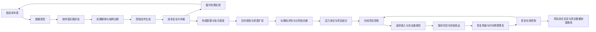

# 28-agent 研究平台项目级总览

## 一句话定位

这套原型不是单纯用机器学习拟合黑箱过程，而是用循环式水处理结构为低成本传感和慢证据争取时间，再用软传感器、多智能体诊断、闭环控制、项目重规划和恢复回放，把黑箱逐步变成可解释、可干预、可回退的灰箱系统。

## 当前结论

- 当前成熟度：`research_platform_ready_for_field_calibration`。
- 最新恢复控制：`maintain_conditional_recovery`。
- 下一轮条件恢复进水比例：`0.75`。
- 失败回退比例：`0.6`。
- 是否需要重规划：`False`。
- 当前回归：`240 passed`。

## 总流程

## 模块架构

### 1-2 低成本感知与灰箱状态估计

- Agent：DataQualityAgent, SoftSensorAgent
- 作用：把低成本传感流转换为可用于控制的隐藏过程状态。
- 输出：sensor_confidence, soft_state, hydraulic_confidence, release_readiness

### 3-4 机理解释与故障诊断

- Agent：MechanismAgent, FaultDiagnosisAgent
- 作用：把软传感状态解释为污染物、材料和过程故障机制。
- 输出：mechanism_hypotheses, fault_modes, knowledge_matches

### 5-10 动作生成、成本安全与闭环仲裁

- Agent：CatalystLifecycleAgent, ValidationPlanningAgent, ControlStrategyAgent, StrategyProfileAgent, CostSafetyAgent, ArbitrationAgent
- 作用：把诊断结论转化为回流、暂存、加药、再生、更换、放行等可执行动作。
- 输出：control_actions, objective_score, final_action, safety_gates

### 11-13 传感配置、慢证据窗口与批次队列

- Agent：SensitivityAnalysisAgent, OperationsSchedulingAgent, QueuePlanningAgent
- 作用：检验低成本传感是否能靠循环窗口和队列组织变得可执行。
- 输出：sensor_design_rankings, campaign_bottlenecks, queue_policy

### 14-18 资源扩容、长期经济性与实施韧性

- Agent：ResourceExpansionAgent, LongTermEconomicsAgent, PhasedImplementationAgent, ImplementationStressTestAgent, AdaptivePortfolioAgent
- 作用：把运行瓶颈转成资源建设、预算释放和备用项目包。
- 输出：selected_intervention, selected_program, phase_plan, selected_portfolio

### 19-23 在线项目控制、遥测接入与自动重规划

- Agent：OnlineProjectControlAgent, CampaignTelemetryAgent, ReplanningOrchestratorAgent, ControlBaselineUpdateAgent, PostReplanReplayAgent
- 作用：把真实 campaign 遥测接回项目控制，并自动重跑规划链与写回基线。
- 输出：rolling_control_state, replan_trace, updated_baseline, post_replan_replay

### 24-28 恢复放量、时间预算修复与恢复在线控制

- Agent：RecoveryRampAgent, TimeBudgetRecoveryAgent, RecoveryStrategyWritebackAgent, RecoveryExecutionReplayAgent, RecoveryOnlineControlAgent
- 作用：把保护性限流后的恢复负荷做成带回退线的条件恢复闭环。
- 输出：safe_ramp_fraction, recovery_policy, execution_replay, fallback_rule

## 证据链

- 低成本传感不是直接替代高端仪器，而是通过循环、暂存和慢证据窗口把黑箱过程变成可推断灰箱。 Agent1-11 已形成传感质控、软传感估计、机理解释、动作仲裁和传感配置敏感性分析。
- 单批次闭环可行不等于多批次运行可行，真实瓶颈会出现在验证工时、总时间窗口和催化剂库存。 Agent12-13 识别验证容量、campaign 时间预算和催化剂库存瓶颈，仅靠队列排序不能完全解除。
- 系统需要能把瓶颈转化为资源、预算和实施阶段，而不是停留在控制动作层。 Agent14-23 完成资源扩容、长期经济性、分阶段实施、压力测试、项目组合、在线重规划和基线写回。
- 循环结构可以降低传感与反应速度要求，但恢复负荷必须被时间预算和回退线约束。 Agent24 发现 0.75 会触发时间预算瓶颈，Agent25 通过验证错峰使 0.75 条件恢复可行。
- 恢复策略需要执行回放验证，不能只写在报告或配置里。 Agent27 显示无错峰 0.75 时间占用 0.978，执行错峰后降到 0.884，瓶颈为空。
- 最新状态可以维持条件恢复，但仍不是永久满负荷基线。 Agent28 接回在线控制后维持 0.75，保留 0.60 回退线，当前无需重规划。

## 下一步校准

当前可以作为研究原型、项目书和汇报核心方案，但仍需要真实数据校准，尤其是传感器漂移、软传感器标签、催化剂寿命、副产物风险、时间预算、快代理触发标签和现场控制接口。

- P1 真实传感器噪声与漂移标定：校准 DataQualityAgent 阈值、采样噪声模型和 sensor_confidence 计算。
- P2 软传感器真实水样重训：用真实标签更新 soft sensor calibrator，并加入不确定性输出。
- P3 催化剂生命周期与副产物风险校准：校准再生收益衰减、replace trigger、副产物安全门和验证规划规则。
- P4 闭环控制与循环时间预算中试验证：校准 Agent24-28 的时间预算、错峰收益、恢复爬坡和 fallback triggers。
- P5 经济性与部署接口验证：校准 sensor economics、资源扩容成本、预算释放顺序和现场执行接口。
- P6 时间戳回放与快代理现场验证：按 Agent42 schema 采集 sensor、lab、operation 和 fast_proxy_event_log，并由 Agent43 G6/P6 门控决定是否允许写入 matrix_shock 保护性控制。
- P7 现场 replay 包导入验收：按 Agent44 协议提交 metadata.json 与四张 CSV，先通过 provenance、field origin、字段、类型转换和 batch 关联门，再进入 Agent42/Agent43。
- P8 现场 replay 证据链：按 Agent44 -> Agent42 -> Agent43 -> Agent45 顺序重跑，只有完整链条通过后才形成保护性写回候选。
- P9 软传感 field holdout 放行门控：采集真实 field holdout 标签，重跑 Agent36 -> Agent39 -> Agent46；只有覆盖率、区间宽度、OOD/abstention、弱目标和场景多样性全部通过后才形成 release gate 校准候选。
- P10 弱目标分层保形校准：补 matrix_interference 与 catalyst_activity 的真实场景标签，先由 Agent47 检查 target/scenario coverage，再交给 Agent46 做 release gate 候选审查。
- P11 管网布点与稀疏感知：补真实管网/处理单元拓扑、水力停留时间、节点维护成本和节点级标签，重跑 Agent48 更新软传感 node-modality 观测矩阵。
- P12 多设施协同控制与策略蒸馏：补真实多节点 sensor/lab/operation/action replay，重跑 Agent49 校准 joint_action_accuracy、reward_regret 和决策树蒸馏准确度。
- P13 模型核心优化治理与自我打断：采用阶段门控与复盘节流，只有展示/整理漂移且不改变模型指标、硬性证据矛盾、synthetic/template 误写成 field 结论或绕过 field replay/保护边界时才立即中断；普通新想法只进入阶段边界 backlog，不触发新 goal 或项目级重排，完成当前可验证小闭环后再按复盘预算统一运行 Agent50/60。
- P14 催化剂活性代理观测：采集催化剂床前后 UV254/ORP、压降、再生事件和离线 catalyst_activity 标签，重跑 Agent51 形成 field_proxy_holdout，再由 Agent50 判断是否回到 P2 校准代理或继续保持 Agent49/52 的保护性边界。
- P15 多设施 replay 离线评估：采集真实多节点 sensor/lab/operation/action/reward replay，重跑 Agent52 校准 joint_action_accuracy、reward_regret、保护性误触发成本和决策树回放准确率；只有 field replay 达标后，Agent49 才能从候选策略进入执行器候选。
