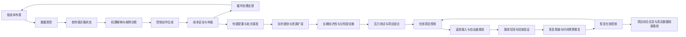

# Agent 29 项目综合总览报告

- summary: 项目综合总览：已综合 28 个执行 agent；当前成熟度为 research_platform_ready_for_field_calibration，下一轮应进入真实数据校准。
- synthesized_agent_count: `28`
- maturity_level: `research_platform_ready_for_field_calibration`
- latest_regression: `133 passed`
- recovery_control_mode: `maintain_conditional_recovery`
- next_intake_fraction: `0.75`
- fallback_intake_fraction: `0.6`
- replan_required: `False`

## 总流程图

## 模块分组

| 模块 | Agent | 研究作用 | 核心输出 |
| --- | --- | --- | --- |
| 低成本感知与灰箱状态估计 | 1-2 | 把低成本传感流转换为可用于控制的隐藏过程状态。 | sensor_confidence, soft_state, hydraulic_confidence, release_readiness |
| 机理解释与故障诊断 | 3-4 | 把软传感状态解释为污染物、材料和过程故障机制。 | mechanism_hypotheses, fault_modes, knowledge_matches |
| 动作生成、成本安全与闭环仲裁 | 5-10 | 把诊断结论转化为回流、暂存、加药、再生、更换、放行等可执行动作。 | control_actions, objective_score, final_action, safety_gates |
| 传感配置、慢证据窗口与批次队列 | 11-13 | 检验低成本传感是否能靠循环窗口和队列组织变得可执行。 | sensor_design_rankings, campaign_bottlenecks, queue_policy |
| 资源扩容、长期经济性与实施韧性 | 14-18 | 把运行瓶颈转成资源建设、预算释放和备用项目包。 | selected_intervention, selected_program, phase_plan, selected_portfolio |
| 在线项目控制、遥测接入与自动重规划 | 19-23 | 把真实 campaign 遥测接回项目控制，并自动重跑规划链与写回基线。 | rolling_control_state, replan_trace, updated_baseline, post_replan_replay |
| 恢复放量、时间预算修复与恢复在线控制 | 24-28 | 把保护性限流后的恢复负荷做成带回退线的条件恢复闭环。 | safe_ramp_fraction, recovery_policy, execution_replay, fallback_rule |

## 关键证据链

### problem_framing

- 判断：低成本传感不是直接替代高端仪器，而是通过循环、暂存和慢证据窗口把黑箱过程变成可推断灰箱。
- 证据：Agent1-11 已形成传感质控、软传感估计、机理解释、动作仲裁和传感配置敏感性分析。

### campaign_bottleneck_discovery

- 判断：单批次闭环可行不等于多批次运行可行，真实瓶颈会出现在验证工时、总时间窗口和催化剂库存。
- 证据：Agent12-13 识别验证容量、campaign 时间预算和催化剂库存瓶颈，仅靠队列排序不能完全解除。

### resource_replanning

- 判断：系统需要能把瓶颈转化为资源、预算和实施阶段，而不是停留在控制动作层。
- 证据：Agent14-23 完成资源扩容、长期经济性、分阶段实施、压力测试、项目组合、在线重规划和基线写回。
- 指标：`{"verdict": "validated", "validation_usage_before": 1.406, "validation_usage_after": 0.337, "time_usage_before": 1.188, "time_usage_after": 0.755, "removed_bottlenecks": ["campaign_time_budget", "catalyst_inventory", "validation_capacity"]}`

### conditional_recovery

- 判断：循环结构可以降低传感与反应速度要求，但恢复负荷必须被时间预算和回退线约束。
- 证据：Agent24 发现 0.75 会触发时间预算瓶颈，Agent25 通过验证错峰使 0.75 条件恢复可行。
- 指标：`{"selected_candidate_id": "stagger_validation_overlap", "target_intake_fraction": 0.75, "time_budget_usage": 0.884, "validation_staff_usage": 0.394, "elapsed_reduction_min": 90.2}`

### execution_validation

- 判断：恢复策略需要执行回放验证，不能只写在报告或配置里。
- 证据：Agent27 显示无错峰 0.75 时间占用 0.978，执行错峰后降到 0.884，瓶颈为空。
- 指标：`{"replay_verdict": "recovery_execution_validated", "time_usage_without_strategy": 0.978, "time_usage_with_strategy": 0.884, "strategy_bottleneck_ids": [], "recommended_next_intake_fraction": 0.75}`

### online_control_state

- 判断：最新状态可以维持条件恢复，但仍不是永久满负荷基线。
- 证据：Agent28 接回在线控制后维持 0.75，保留 0.60 回退线，当前无需重规划。
- 指标：`{"recovery_control_mode": "maintain_conditional_recovery", "next_intake_fraction": 0.75, "fallback_intake_fraction": 0.6, "replan_required": false, "bottleneck_ids": []}`

## 真实数据校准路线

| 阶段 | 主题 | 需要的数据 | 模型更新 |
| --- | --- | --- | --- |
| P1 | 真实传感器噪声与漂移标定 | pH/ORP/EC/浊度/流量/UV254 原始时间序列；人工校准记录；传感器污染结垢/清洗记录 | 校准 DataQualityAgent 阈值、采样噪声模型和 sensor_confidence 计算。 |
| P2 | 软传感器真实水样重训 | 目标污染物/COD/TOC/UV254 离线检测；反应时间、加药量、回流比；达标/未达标标签 | 用真实标签更新 soft sensor calibrator，并加入不确定性输出。 |
| P3 | 催化剂生命周期与副产物风险校准 | 催化剂循环次数；再生前后活性；压降/表面污染；副产物或余氧化剂检测 | 校准再生收益衰减、replace trigger、副产物安全门和验证规划规则。 |
| P4 | 闭环控制与循环时间预算中试验证 | 批次运行记录；暂存/回流/验证并行时间；失败回退案例；人工干预记录 | 校准 Agent24-28 的时间预算、错峰收益、恢复爬坡和 fallback triggers。 |
| P5 | 经济性与部署接口验证 | 传感器报价；试剂/催化剂/人工成本；PLC/SCADA 点表；安全联锁要求 | 校准 sensor economics、资源扩容成本、预算释放顺序和现场执行接口。 |

## 建议

- 将当前 28-agent 执行链作为项目书和汇报的核心原型，明确其定位为“可校准研究平台”。
- 下一轮优先接入真实传感器时间序列和离线检测标签，校准软传感器、时间预算和 fallback triggers。
- 保留 0.75 条件恢复、0.60 回退线和 campaign 后复核，不把仿真稳定结果写成永久满负荷结论。

## 风险边界

- `field_validation_missing`：当前链条已适合研究原型与项目论证，但尚未用真实连续运行数据完成现场校准。